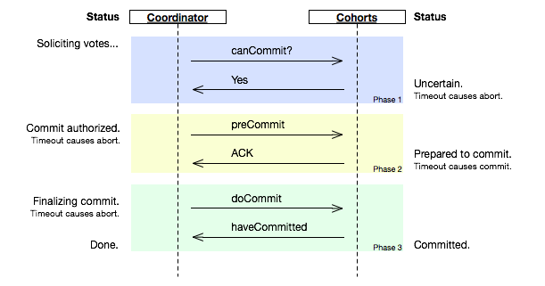

# two phase commit and three phase commit

## 2PC
1. The commit-request phase (or voting phase), in which a coordinator process attempts to prepare all the transaction's participating processes (named participants, cohorts, or workers) to take the necessary steps for either committing or aborting the transaction and to vote, either "Yes": commit (if the transaction participant's local portion execution has ended properly), or "No": abort (if a problem has been detected with the local portion), and
2. The commit phase, in which, based on voting of the cohorts, the coordinator decides whether to commit (only if all have voted "Yes") or abort the transaction (otherwise), and notifies the result to all the cohorts. The cohorts then follow with the needed actions (commit or abort) with their local transactional resources (also called recoverable resources; e.g., database data) and their respective portions in the transaction's other output (if applicable).
```
Coordinator                                         Cohort
                              QUERY TO COMMIT
                -------------------------------->
                              VOTE YES/NO           prepare*/abort*
                <-------------------------------
commit*/abort*                COMMIT/ROLLBACK
                -------------------------------->
                              ACKNOWLEDGMENT        commit*/abort*
                <--------------------------------  
end

```

The greatest **disadvantage** of the two-phase commit protocol is that it is a blocking protocol. If the coordinator fails permanently, some cohorts will never resolve their transactions: After a cohort has sent an agreement message to the coordinator, it will block until a commit or rollback is received.  


二阶段提交协议主要分为来个阶段：准备阶段和提交阶段。  
值得注意的是，二阶段提交协议的第一阶段准备阶段不仅仅是回答YES or NO，还是要执行事务操作的，只是执行完事务操作，并没有进行commit还是roolback。和上面的结婚例子不太一样。如果非要举例的话可以理解为男女双方交换定情信物的过程。信物一旦交给对方了，这个信物就不能挪作他用了。也就是说，一旦事务执行之后，在没有执行commit或者roolback之前，资源是被锁定的。这会造成阻塞。  

第二阶段协调者和参与者挂了，挂了的这个参与者在挂之前已经执行了操作。但是由于他挂了，没有人知道他执行了什么操作。  

这种情况下，新的协调者被选出来之后，如果他想负起协调者的责任的话他就只能按照之前那种情况来执行commit或者roolback操作。这样新的协调者和所有没挂掉的参与者就保持了数据的一致性，我们假定他们执行了commit。但是，这个时候，那个挂掉的参与者恢复了怎么办，因为他之前已经执行完了之前的事务，如果他执行的是commit那还好，和其他的机器保持一致了，万一他执行的是roolback操作那？这不就导致数据的不一致性了么？虽然这个时候可以再通过手段让他和协调者通信，再想办法把数据搞成一致的，但是，这段时间内他的数据状态已经是不一致的了！  

## 3PC
 

A two-phase commit protocol cannot dependably recover from **a failure of both the coordinator and a cohort member during the Commit phase.**  
Both the coordinator and a cohort member failed, it is possible that the failed cohort member was the first to be notified, and had actually done the commit. Even if a new coordinator is selected, it cannot confidently proceed with the operation until it has received an agreement from all cohort members, and hence must block until all cohort members respond.  

The three-phase commit protocol eliminates this problem by introducing the **Prepared to commit state.** If the coordinator fails before sending preCommit messages, the cohort will unanimously agree that the operation was aborted. The coordinator will not send out a doCommit message until all cohort members have ACKed that they are Prepared to commit. This eliminates the possibility that any cohort member actually completed the transaction before all cohort members were aware of the decision to do so (an ambiguity that necessitated indefinite blocking in the two-phase commit protocol).


3PC最关键要解决的就是协调者和参与者同时挂掉的问题，所以3PC把2PC的准备阶段再次一分为二，这样三阶段提交就有CanCommit、PreCommit、DoCommit三个阶段。在第一阶段，只是询问所有参与者是否可可以执行事务操作，并不在本阶段执行事务操作。当协调者收到所有的参与者都返回YES时，在第二阶段才执行事务操作，然后在第三阶段在执行commit或者rollback。  

如果挂掉的那台机器已经执行了commit，那么协调者可以从所有未挂掉的参与者的状态中分析出来，并执行commit。如果挂掉的那个参与者执行了rollback，那么协调者和其他的参与者执行的肯定也是rollback操作  

## Reference
- [深入理解分布式系统的2PC和3PC](http://www.hollischuang.com/archives/1580)
- [2pc wiki](https://en.wikipedia.org/wiki/Two-phase_commit_protocol)
- [3pc wiki](https://en.wikipedia.org/wiki/Three-phase_commit_protocol)
