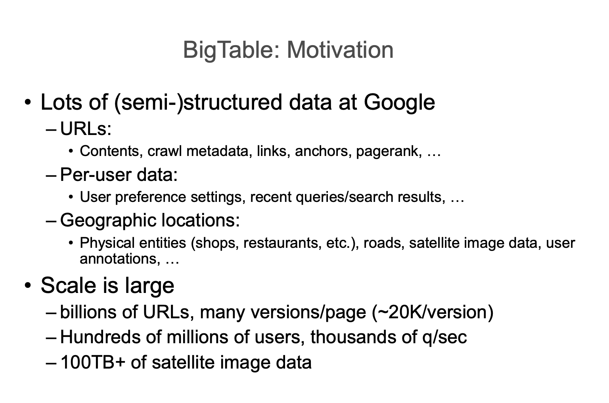
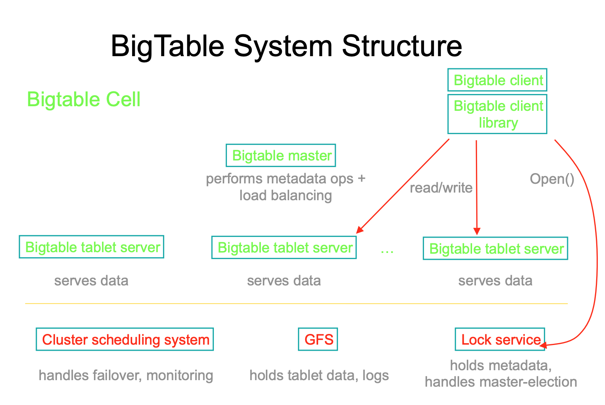
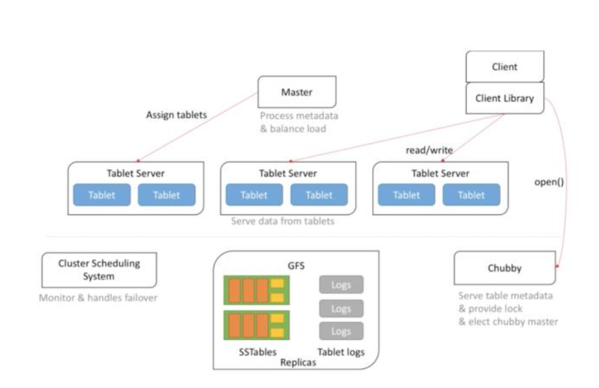
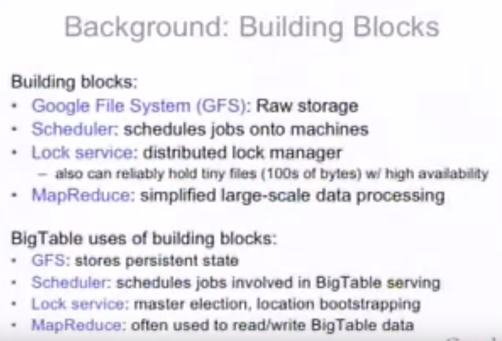
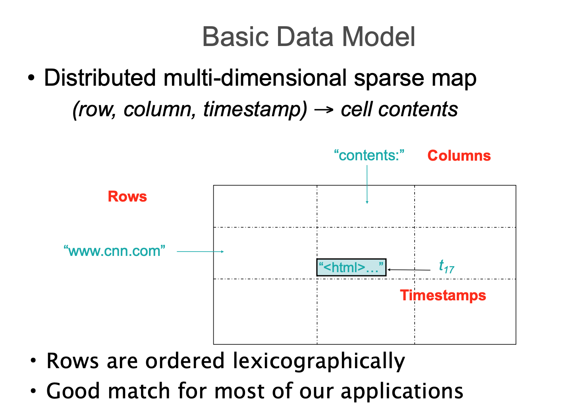
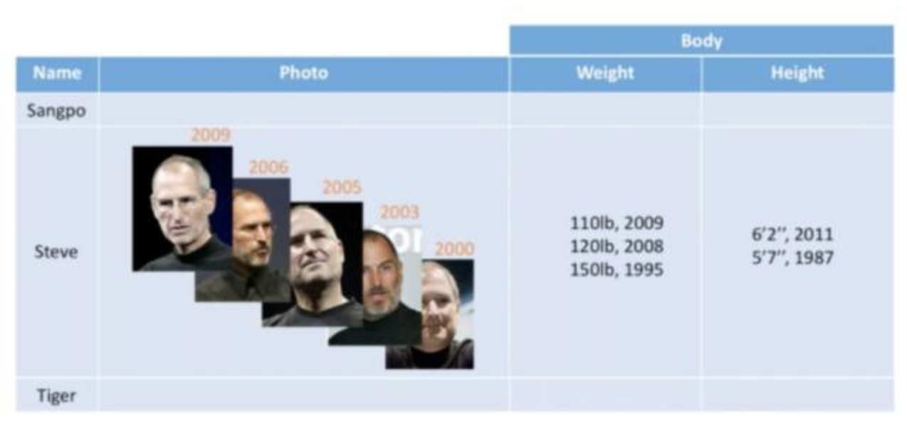
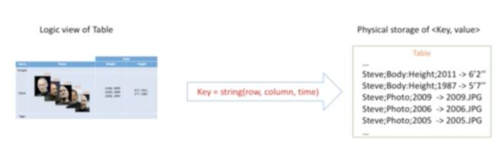

- [Big table](#big-table)
  - [Background](#background)
    - [Motivation](#motivation)
    - [Why not commercial DB](#why-not-commercial-db)
    - [What](#what)
    - [System Structure](#system-structure)
    - [Data model](#data-model)
      - [Table's logic view](#tables-logic-view)
      - [Logic view to physical storage](#logic-view-to-physical-storage)
  - [Key words](#key-words)
    - [map](#map)
    - [Persistent](#persistent)
    - [Distributed](#distributed)
    - [Sorted](#sorted)
    - [Multidimensional](#multidimensional)
    - [Sparse](#sparse)
  - [More info](#more-info)

# Big table

```
A Bigtable is a sparse, distributed, persistent multidimensional sorted map.

The map is indexed by a row key, column key, and a timestamp; each value in the map is an uninterpreted array of bytes.
```
## Background

### Motivation


<br/>


### Why not commercial DB
- Google's data is too large to scale
- Cost is too high
- Low level storage opertimization helps performance significantly

### What

<br/>


### System Structure


<br/>



<br/>


<br/>


### Data model

<br/>

#### Table's logic view


<br/>


#### Logic view to physical storage


<br/>


## Key words

### [map](https://en.wikipedia.org/wiki/Associative_array)
At its core, BigTable is a map.  A map is "an abstract data type composed of a collection of keys and a collection of values, where each key is associated with one value."  Example: 

```
{
  "zzzzz" : "woot",
  "xyz" : "hello",
  "aaaab" : "world",
  "1" : "x",
  "aaaaa" : "y"
}
```

### Persistent
Persistence merely means that the data you put in this special map "persists" after the program that created or accessed it is finished.  You could go to [GFS](./gfs.md) to understand how state is persistent.

### Distributed
BigTable is built upon distributed file systems so that the underlying file storage can be spread out among an array of independent machines.  Data is replicated across a number of participating nodes.  Refer to [GFS](./gfs.md) for more details.

### Sorted
key/value pairs are kept in strict alphabetical order. 
For example, row for the key "aaaab" should be right next to the row with key "aaaaa" and very far from the row with key "zzzzz".

```
{
  "1" : "x",
  "aaaaa" : "y",
  "aaaab" : "world",
  "xyz" : "hello",
  "zzzzz" : "woot"
}
```
- Sorting means better locality: During your table scan, the items of greatest interest to you are near each other.
- It is important when choosing a row key convention.
   + `com.jimbojw.www` better than `www.jimbojw.com`
   + `mail.jimbojw.com` should be near to `www.jimbojw.com` rather than `mail.xyz.com`
- Value is not sorted


### Multidimensional
- `column` could be treat as a nested structure inside `table`.
```
{
  "1" : {
    "A" : "x",
    "B" : "z"
  },
  "aaaaa" : {
    "A" : "y",
    "B" : "w"
  },
  "aaaab" : {
    "A" : "world",
    "B" : "ocean"
  },
  "xyz" : {
    "A" : "hello",
    "B" : "there"
  },
  "zzzzz" : {
    "A" : "woot",
    "B" : "1337"
  }
}
// each key points to a map with exactly two keys: "A" and "B".
// top-level key/map pair as a "row".
// the "A" and "B" mappings would be called "Column Families".
```
- A table's column families are specified when the table is created, and are difficult or impossible to modify later.  But, a column family may have any number of columns, denoted by a column "qualifier" or "label".  
```
{
    "aaaaa" : {
    "A" : {
      "foo" : "y",
      "bar" : "d"
    },
    "B" : {
      "" : "w"
    }
  },
}
// the "A" column family has two columns: "foo" and "bar"
```
- When asking BigTable for data, you must provide the full column name in the form "<family>:<qualifier>".  For example, "A:foo", "A:bar".

- The column families are static, the columns themselves are not.  Each row may have any number of different columns, there's no built-in way to query for a list of all columns in all rows. To get that information, you'd have to do a full table scan. 

- The final dimension represented in BigTable is time.  In most cases, applications will simply ask for a given cell's data, without specifying a timestamp, BigTable will return the most recent version since it stores these in reverse chronological order.

```
{
  // ...
  "aaaaa" : {
    "A" : {
      "foo" : {
        15 : "y",
        4 : "m"
      },
      "bar" : {
        15 : "d",
      }
    },
  // ...
}
```


### Sparse

 A given row can have any number of columns in each column family, or none at all. The other type of sparseness is row-based gaps which merely means that there may be gaps between keys.


## More info
- [Bigtable: A Distributed Storage System for Structured Data](https://static.googleusercontent.com/media/research.google.com/en//archive/bigtable-osdi06.pdf)
- [BigTable: A Distributed Structured Storage System By Jeff Dean 2014](https://www.youtube.com/watch?v=2cXBNQClehA) <span>&#9733;</span><span>&#9733;</span><span>&#9733;</span><span>&#9733;</span>
- [Designs, Lessons and Advice from Building Large Distributed Systems By Jeff Dean](https://www.cs.cornell.edu/projects/ladis2009/talks/dean-keynote-ladis2009.pdf) 
- [Building Software Systems At Google and Lessons Learned By Jeff Dean 2011](https://www.youtube.com/watch?v=modXC5IWTJI)
- [Introduction to HBase Schema Design](http://0b4af6cdc2f0c5998459-c0245c5c937c5dedcca3f1764ecc9b2f.r43.cf2.rackcdn.com/9353-login1210_khurana.pdf)
- [Understanding HBase and BigTable](https://dzone.com/articles/understanding-hbase-and-bigtab) [CN](https://www.cnblogs.com/ajianbeyourself/p/7789952.html)
- [Introduction to HBase Schema Design By Amandeep Khurana](http://0b4af6cdc2f0c5998459-c0245c5c937c5dedcca3f1764ecc9b2f.r43.cf2.rackcdn.com/9353-login1210_khurana.pdf)
- [Google Cloud Bigtable](https://cloud.google.com/bigtable/) 
   + [Bigtable in action (Google Cloud Next '17)](https://www.youtube.com/watch?v=KaRbKdMInuc&list=PLZuzb42lP7X7LlVIPJ0iaJgd4thV3qxfL&index=13)
- [github - spotify/simple-bigtable](https://github.com/spotify/simple-bigtable)
- [谷歌技术"三宝"之BigTable](https://blog.csdn.net/OpenNaive/article/details/7532589)
- [Rutgers CS 417 Distribute Systems - BigTable](https://www.cs.rutgers.edu/~pxk/417/notes/content/bigtable.html)
- [Bittiger Bigtable](https://posts.careerengine.us/p/5c1f17f86f311d533b55a93e)
- [浅析 Bigtable 和 LevelDB 的实现](https://draveness.me/bigtable-leveldb)