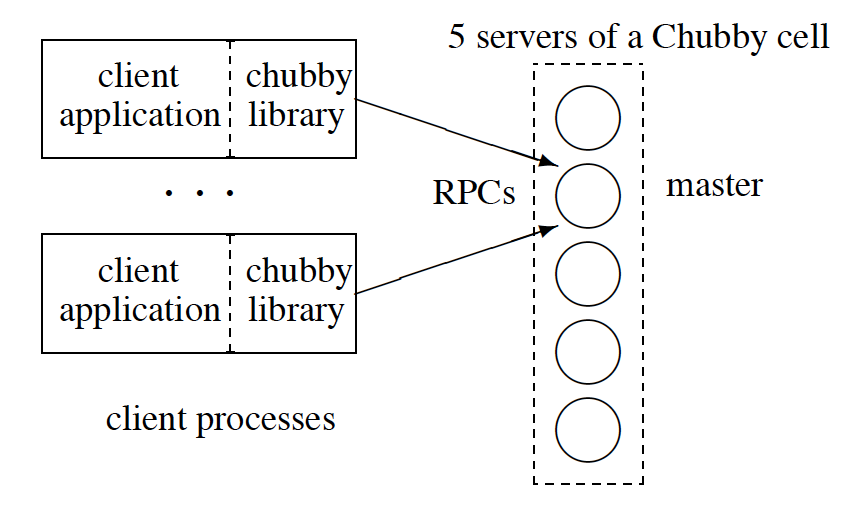

# Chubby

Chubby是一个lock service，通过这个lock service可以解决分布式中的一致性问题，而这个lock service的实现是一个分布式的文件系统。  Chubby implemented based on [PAXOS](https://en.wikipedia.org/wiki/Paxos_(computer_science)).

## Backgrounds

Chubby Keywords
- **Coarse grained**
- **Reliable**
- **Lock service**

```
Chubby’sdesign is based on well-known ideas that have meshed well: distributed consensus 
among a few replicas for fault tolerance, consistent client-side caching to reduce server 
load while retaining simple semantics, timely notification of updates, and a familiar file 
system interface. We use caching, protocol-conversion servers, and simple load adaptation 
to allow it scale to tens of thousands of client processes per Chubby instance. We expect 
to scale it further via proxies and partitioning. Chubby has become Google’s primary 
internal name service; it is a common rendezvous mechanism for systems such as MapReduce; 
the storage systems GFS and Bigtable use Chubby to elect a primary from redundant replicas; 
and it is a standard repository for files that require high availability, such as access 
control lists.
```

<span style="color:blue">Why build a coarse-grained locking service?</span>

- Creating a lock service rather than just a client library made it easier to integrate with existing applications.
```
our developers sometimes do not plan for high availability in the way one would wish.
```
- A lock-based interface is also familiar to Google’s programmers
```
many programmers have come across locks before, and think they know to use them. Ironically, 
such programmers are usually wrong, especially when they use locks in a distributed system; 
few consider the effects of independent machine failures on locks in a system with asynchronous 
communications. Nevertheless, the apparent familiarity of locks overcomes a hurdle in persuading 
programmers to use a reliable mechanism for distributed decision making.
```
- Chubby is explicitly designed for coarse-grained locking use cases (for example, when electing a primary), and not for fine-grained locks that might be held only for a short duration. This has important consequences for the design of Chubby
```
Coarse-grained locks impose far less load on the lock server. In particular, the lock-acquisition
rate is usually only weakly related to the transaction rate of the client applications … 
it is good for coarse-grained locks to survive lock-server failures, but there is little 
concern about the overhead of doing so, and such locks allow many clients to be adequately 
served by a modest number of lock servers with somewhat lower availability.
```

## Architecture


<br/>


<br/>


Chubby 基本上分为了两部分：服务器一端，称为Chubby cell；client一端，每个Chubby的client都有一个Chubby library。这两部分通过RPC进行通信。
client端通过Chubby library的接口调用，在Chubby cell上创建文件来获得相应的锁的功能。

### Chubby cell的一致性

一般来说，一个Chubby cell由五台server组成，可以支持一整个数据中心的上万台机器的lock service。
cell中的每台server我们称之为replicas（副本）。
当 Chubby工作的时候，首先它需要从这些replicas中选举出一个master。注意，这其实也是一个distributed consensus problem，也就是说Chubby也存在着分布式的一致性问题。Chubby是通过采用consensus protocol（很可能就是Paxos算法）来解决这个问题的。所以，Chubby的client用Chubby提供的lock service来解决一致性问题，而Chubby系统内部的一致性问题则是用consensus protocol解决的。
每个master都具有一定的期限，成为master lease。在这个期限中，副本们不会再选举一个其它的master。
为 了安全性和容错的考虑，所有的replicas（包括master）都维护的同一个DB的拷贝。但是，只有master能够接受client提交的操作对 DB进行读和写，而其它的replicas只是和master进行通信来update它们各自的DB。所以，一旦一个master被选举出来后，所有的 client端都之和master进行通信，如果是读操作，那么master一台机器就搞定了，如果是写操作，master会通知其它的 replicas进行update。这样的话，一旦master意外停机，那么其它的replicas也能够很快的选举出另外一个master。

### Chubby的文件系统
Chubby的底层实现其实就是一个分布式的文件系统。这个文件系统的接口是类似于Unix系统的。例如，对于文件名“/ls/foo /wombat/pouch”，ls表示的是“lock service”，foo表示的是某个Chubby cell的名字，wombat/pouch则是这个cell上的某个文件目录或者文件名。如果一个client端使用Chubby library来创建这样一个文件名，那么这样一个文件就会在Chubby cell上被创建。
Chubby的文件系统由于它的特殊用途做了很多的简化。例如它不支持文件的转移，不记录文件最后访问时间等等。整个文件系统只包含有文件和目录，统一称为“Node”。文件系统采用Berkeley DB来保存Node的信息，主要是一种map的关系。Key就是Node的名字，Value就是Node的内容。
还有一点需要提及的是，Chubby cell和client之间用了event形式的通知机制。client在创建了文件之后会得到一个handle，并且还可以订阅一系列的event，例如文件内容修改的event。这样的话，一旦client相关的文件内容被修改了，那么cell会通过机制发送一个event来告诉client该文件被修改了。

### client与cell的交互
这里大致包含两部分的内容：cache的同步机制和KeepAlive握手协议。
为 了降低client和cell之间通信的压力和频率，client在本地会保存一个和自己相关的Chubby文件的cache。例如如果client通过 Chubby library在cell上创建了一个文件，那么在client本地，也会有一个相同的文件在cache中创建，这个cache中的文件的内容和cell 上文件的内容是一样的。这样的话，client如果想访问这个文件，就可以直接访问本地的cache而不通过网络去访问cell。
cache有两个状态，有效和无效。当 有一个client要改变某个File的时候，整个修改会被master block，然后master会发送无效标志给所有cache了这个数据的client（它维护了这么一个表），当其它client端收到这个无效标志 后，就会将cache中的状态置为无效，然后返回一个acknowledge；当master确定收到了所有的acknowledge之后，才完成整个 modification。
需要注意的是，master并不是发送update给client而是发送无效标志给client。这是因为如果发送update给client，那么每 一次数据的修改都需要发送一大堆的update，而发送无效标示的话，对一个数据的很多次修改只需要发送一个无效标示，这样大大降低了通信量。

至于KeepAlive协议，则是为了保证client和master随时都保持着联系。client和master每隔一段时间就会KeepAlive 一次，这样的话，如果master意外停机，client可以很快的知道这个消息，然后迅速的转移到新的master上。并且，这种转移对于client 端的application是透明的，也就是说application并不会知道master发生了错误。


### advisory lock
Chubby中的lock都是advisory lock。所谓的advisory lock，举个例子，就是说当有人将某个文件锁住以后，如果有其他的人想不解锁而直接访问这个文件，这种行为是不会被阻止的。和advisory lock对应的是mandatory lock，即如果某个文件被锁住以后，如果有其他的人直接访问它，那么这种行为是会产生exception的。

### coarse-grained
coarse-grained意思是粗颗粒度的，Chubby的lock service是coarse-grained，就是说Chubby中的lock一般锁住的时间都比较长，可能是几小时或者几天。与之对应的是 fined-grained，这种lock一般只维持几秒或者更少。这两种锁在实现的时候是会有很多不同的考虑的，比如coarse-grained的 lock service的负载要小很多，因为加锁解锁并不会太频繁。


## More info
- [The Chubby lock service for loosely-coupled distributed systems](https://ai.google/research/pubs/pub27897)
- [Google利器之Chubby](https://blog.csdn.net/historyasamirror/article/details/3870168)
- [The Chubby lock service for loosely coupled distributed systems](https://blog.acolyer.org/2015/02/13/the-chubby-lock-service-for-loosely-coupled-distributed-systems/)
- [Paxos Made Simple](https://www.microsoft.com/en-us/research/publication/paxos-made-simple/?from=http%3A%2F%2Fresearch.microsoft.com%2Fen-us%2Fum%2Fpeople%2Flamport%2Fpubs%2Fpaxos-simple.pdf)