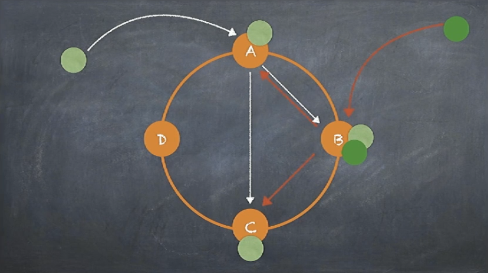

# Dynamo


Which database to choose, mongo or Cassandra 

  <br/>


  <br/>


  <br/>

  <br/>
(Partition is must chosen)


 

(Everything go to master, slave just used for replication)


   <br/>
(Write go to master, read could go to any slave)

 <br/>
(Sharding, different key range go to different replica.  Issue: How to scale, for example certain key range could be much large than others)


  <br/>
Consistent hashing, tasks be divided much large than machine number

  <br/>


  <br/>
Certain server hold data for other crashed server


  <br/>


Dynamo++ (Not only dynamo, but other relation database)
We want database has one function, compare and set, for example, let's say you have 300 airplane ticket for sell, how to make sure last ticket won't be over booked, such as when reach 299, there are multiple user want to have the ticket, how to just let one user to get ticket and reject other users

Distribute writing is different with DB writing, different user could go to different replication(each client could choose its own server) for read and write


 <br/>

Let's say you have 3 replica, rather than keep on appending, let all three stop what they are doing, have them chat and agree on next.
Its very slow.   What you need is consensus algorithm, for distribute consensus (PAXOS, RAFT)


## More info

### What is Dynamo: a distribute key/value storage engine for Amazon

Problem set: 
 - Scale: Rebalance during more nodes be added 
 - Data reliability: Hardware fail
 - Single point of failure: Avoid one node fail which might causes entire system failure


### Scale
Shading is the strategy to improve performance.   How to group data is the key.  
Say that you use a number(node count) to hash data.  The biggest challenge would be, <span style="color:blue">when hash value changes later, all the data hash with new value and could get different value, which results almost everything need to be moved.  </span>  

  <br/>

- Let each machine holds value between him and his previous node, when new machine added into system, then only nearby nodes will be affected
- <span style="color:blue">What if different machine has different hardware? </span> We want the powerful machine could hold more data compare to normal machine.  This is why dynamo evolve **virtual node**. 
We could divide the circle to Q parts, each part means one virtual node, and virtual node's number could be much bigger than physical machine.(Q>>S, S is the number of machine or resource)  And physical machine only deal with virtual nodes.  
  When new machine be added or some machine be deleted from system, only data related with that specific server need to be moved. 
- The number of Q should be reasonable for a while, but if your business increasing very quick made Q>>S is not true, then the benefit would decrease.  Refer to 6.2 in original paper.


### Data reliability
- <span style="color:blue">Commodity hardware could fail any time.</span>
- master-slave.  <span style="color:blue"> What if master is down, we change slave to master, then slave also down?<span>  That's the reason for 3 copies or more.
- How to choose backup nodes?  
  - Virtual node in the circle and following current node could be the backup, as long as they are not on the same physical node. 
     - When node is down, we need backup all data related with this node
     - When new node is added, it will steal data from other node, and we should also adjust backup data in the system
- <span style="color:blue"> What is a successful write? </span>
     - Synchronized write(slow) vs Asynchronized write(stale read)
     - W + R > N (读取的份数一定要比总备份数减去确保写成功的倍数的差值要大)
- <span style="color:blue"> How to handle multiple user modify the same key </span>
  - User1 read key1 as 1, user2 read key1 as 1, user1 increase key1 with 1 to 2 and write back, user2 increase key1 with 1 to 2 and write back which will cause issue
  - <span style="color:blue"> Version control. </span>  
     -  If there is just one copy of data.  User1 read key1 as 1 and get V1 from server, user2 read key1 as 1 and get V1 from server, user1 increase key1 with 1 to 2 and write back with V1, server check V1 is the same with him then increase value and also increase version to V2, then V2's write will be failed
  - If there are <span style="color:blue">multiple copies</span>, it will become more complex.  Dynamo will keep all versions and using vector clock to record version information, then use client side's business logic to deal with confliction.
```
把这个vector clock想象成每个节点都记录自己的版本信息，而一个数据，包含所有这些版本信息。来看一个例子：假设一个写请求，第一次被节点A处理了。节点A会增加 一个版本信息(A，1)。我们把这个时候的数据记做D1(A，1)。 然后另外一个对同样key(这一段讨论都是针对同样的key的)的请求还是被A处理了于是有D2(A，2)。这个时候，D2是可以覆盖D1的，不会有冲突 产生。现在我们假设D2传播到了所有节点(B和C)，B和C收到的数据不是从客户产生的,而是别人复制给他们的,所以他们不产生新的版本信息,所以现在B 和C都持有数据D2(A，2)。好，继续，又一个请求，被B处理了，生成数据D3(A，2;B，1)，因为这是一个新版本的数据，被B处理，所以要增加B 的版本信息。假设D3没有传播到C的时候又一个请求被C处理记做D4(A，2;C，1)。假设在这些版本没有传播开来以前，有一个读取操作，我们要记得， 我们的W=1 那么R=N=3，所以R会从所有三个节点上读,在这个例子中将读到三个版本。A上的D2(A，2);B上的D3(A，2;B，1);C上的D4(A，2; C，1)这个时候可以判断出，D2已经是旧版本，可以舍弃，但是D3和D4都是新版本，需要应用自己去合并。如果需要高可写性,就要处理这种合并问题。好 假设应用完成了冲入解决，这里就是合并D3和D4版本，然后重新做了写入，假设是B处理这个请求，于是有D5(A,2;B,2;C,1);这个版本将可以 覆盖掉D1-D4那四个版本。
```

### Single point of failure
Seed in dynamo.  De-centralized service

  <br/>


## More info
- [Paper](https://www.allthingsdistributed.com/files/amazon-dynamo-sosp2007.pdf)
- [Werner Vogels - CTO - Paper](https://www.allthingsdistributed.com/2007/10/amazons_dynamo.html)
- [淘宝核心系统团队分享 Dynamo](https://blog.csdn.net/SAN_YUN/article/details/84319559)
- [分布式键值存储 Dynamo 的实现原理](https://draveness.me/dynamo)
