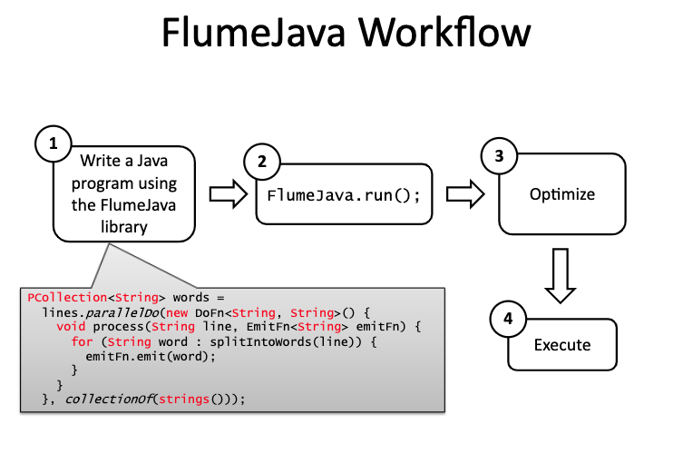
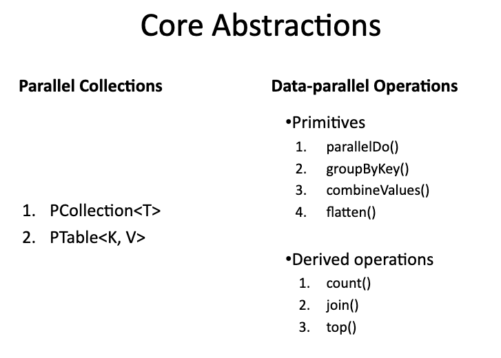

# Flumejava

- Flumejava的核心思想是**将所有的数据都抽象成PCollection的数据结构**。PCollection隐藏具体从内存读取数据，还是在分布式环境下读取文件的逻辑
   + 从测试的好处来看，如果想测试MapReduce, 本需要读取测试数据集，在分布式环境下运行来测试逻辑，有了PCollection, 可以在内存中读取数据然后跑测试文件。也就是同样的逻辑即可分布式环境，也可单机环境
- Flumejava在MapReduce框架中Map和Reduce的思想上，抽象了4个原始操作(primitive operation)
   + parallelDo
   + groupByKey
   + combineValues
   + flatten
- Flumejava运用了Deferred evaluation的技术来优化代码: Flumejava会将逻辑静态分析一遍构造DAG(flumejava中叫Execution plan dataflow graph), 然后由框架自动优化代码
- Flumejava可以通过预测数据集对规模，来预测输出对规模，从而决定在内存中跑还是在分布式下跑

- Flumejava基本只支持batch execution, 对无边界数据(unbounded data)支持较差

   

   

