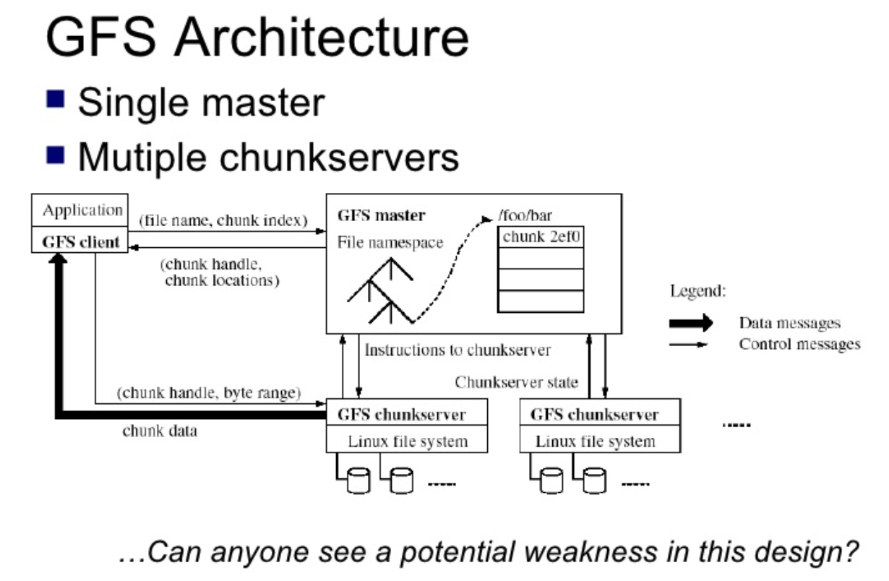
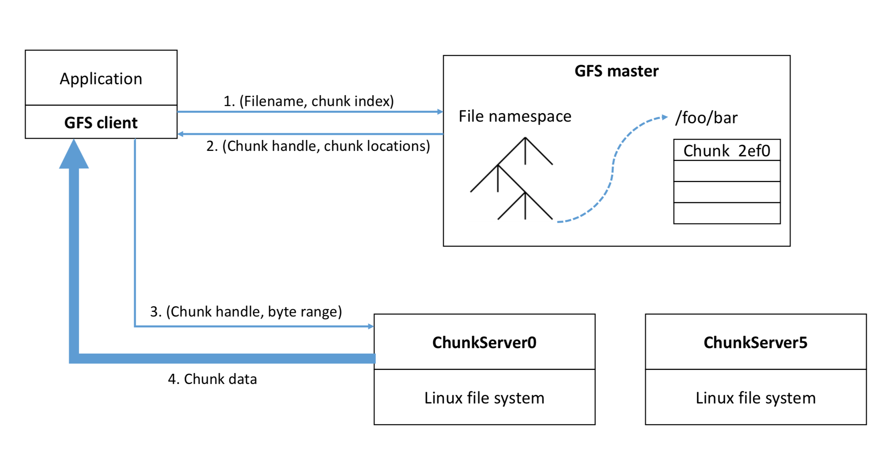
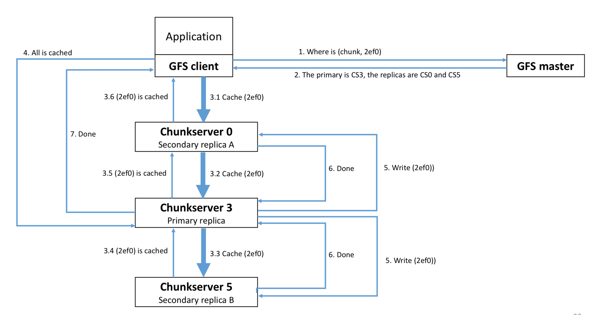

- [Google File System](#google-file-system)    
    - [Challenge for distribute file system](#challenge-for-distribute-file-system)        
        - [Local vs distribute](#local-vs-distribute)        
        - [GFS's challenge](#gfss-challenge)        
        - [GFS's motivation](#gfss-motivation)        
        - [GFS's Assumption](#gfss-assumption)    
    - [GFS's architecture](#gfss-architecture)    
    - [Master's responsibility](#masters-responsibility)    
    - [Operations](#operations)        
        - [Read](#read)        
        - [write/append](#writeappend)    
    - [Fault tolerance](#fault-tolerance)    
    - [Summary](#summary)    
    - [More info](#more-info)<!-- /TOC -->

# Google File System

## Challenge for distribute file system

### Local vs distribute

Local file system | Distribute file system
---|---
Logic unit called files   absolute path and logic path + name | Remote access  Must support concurrency  Replication & local cache Scale

### GFS's challenge
- With many machines failures are common
- Many concurrent readers and writers, high performance is required
   + MR jobs read and store **final** result in GFS
- Use network efficiently

### GFS's motivation
- Redundant storage of massive amount of data on cheap and unreliable devices
- Good for read.  Good for write

### GFS's Assumption
- High component failure rates(commodity components)
- Modest number of huge files
- Files are write once, mostly append to
- Large streaming reads
- High sustained throughput favored over low latency

## GFS's architecture

  

- master must avoid single point of failure
- master has operation log
- shadow masters that lag a little behind master, can be promoted to master
- For each file, master just record the mapping of trunk index <-> trunk server, let trunk server handle how the trunk be recorded

  
## Master's responsibility
- Metadata store
- Namespace management locking
- Periodic communication with chunkservers
- chunk creation, re-replication, rebalancing
- GC
- master keeps state in memory(64 bytes of metadata per each chunk)

## Operations

### Read

  

- send file name and offset to master
- master replies with set of servers that have that chunk
   + response includes version # of chunk
   + clients cache that information
- ask nearest chunk server
   + checks version #
   + if version # is wrong, re-contact master

### write/append

  

- Ask master where to store
    + if append, maybe master chooses a new set of chunk servers if crossing 64 MB
    + master responds with chunk servers and version #
    + one chunk server is primary
    + Write data first to trunk server near user, might not to primary replica
- Clients pushes data to replicas
    + Replicas form a chain
    + Chain respects network topology
    + Allows fast replication
- Client contacts primary when data is on all chunk servers
    + primary assigns sequence number
    + primary applies change locally
    + primary forwards request to replicas
    + primary responds to client after receiving acks from all replicas
- If one replica doesn't respond, client retries
    + After contacting master

## Summary

### Fault tolerance
- fault tolerance of data (3 copies)
- High availability (fast recovery, chunk replication, shadow master)
- Data integrity(checksum)

### P&C
(based on original paper)
Great | Less well
---|---
huge sequential reads and writes appends huge throughput (3 copies, striping) fault tolerance of data (3 copies) |     fault-tolerance of master  small files (master a bottleneck) clients may see stale data appends maybe duplicated

## More info
- [The Google File System](https://static.googleusercontent.com/media/research.google.com/en//archive/gfs-sosp2003.pdf)
- [Distributed computing seminar lecture 3 - distributed file systems - Aaron kimball 2007](https://www.youtube.com/watch?v=5Eib_H_zCEY&t=2394s) [slides](https://www.slideshare.net/tugrulh/distributed-computing-seminar-lecture-3-distributed-file-systems)

