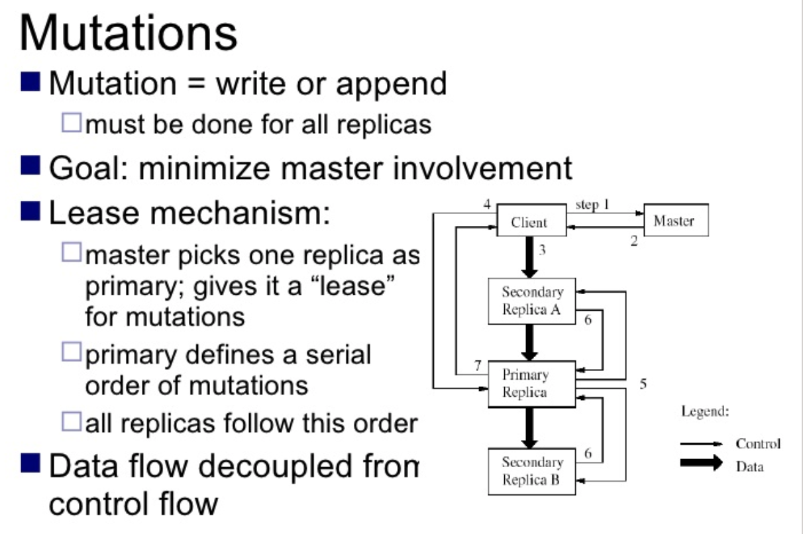

# Google File System

## Challenge for distribute file system

### Local vs distribute

Local file system | Distribute file system
---|---
Logic unit called files   absolute path and logic path + name | Remote access  Must support concurrency  Replication & local cache Scale

### GFS's motivation
- Redundant storage of massive amount of data on cheap and unreliable devices
- Good for read.  Good for write

## GFS's Assumption
- High component failure rates(commodity components)
- Modest number of huge files
- Files are write once, mostly append to
- Large streaming reads
- High sustained throughput favored over low latency

## GFS's architecture

  

- master has single point of failure
- master has operation log
- For each file, master just record the mapping of trunk index <-> trunk server, let trunk server handle how the trunk be recorded

  
## Master's responsibility
- Metadata store
- Namespace management locking
- Periodic communication with chunkservers
- chunk creation, re-replication, rebalancing
- GC

## Fault tolerance
- High availability (fast recovery, chunk replication, shadow master)
- Data integrity(checksum)

## More info
- [The Google File System](https://static.googleusercontent.com/media/research.google.com/en//archive/gfs-sosp2003.pdf)
- [Distributed computing seminar lecture 3 - distributed file systems - Aaron kimball 2007](https://www.youtube.com/watch?v=5Eib_H_zCEY&t=2394s) [slides](Distributed computing seminar   lecture 3 - distributed file systems)

