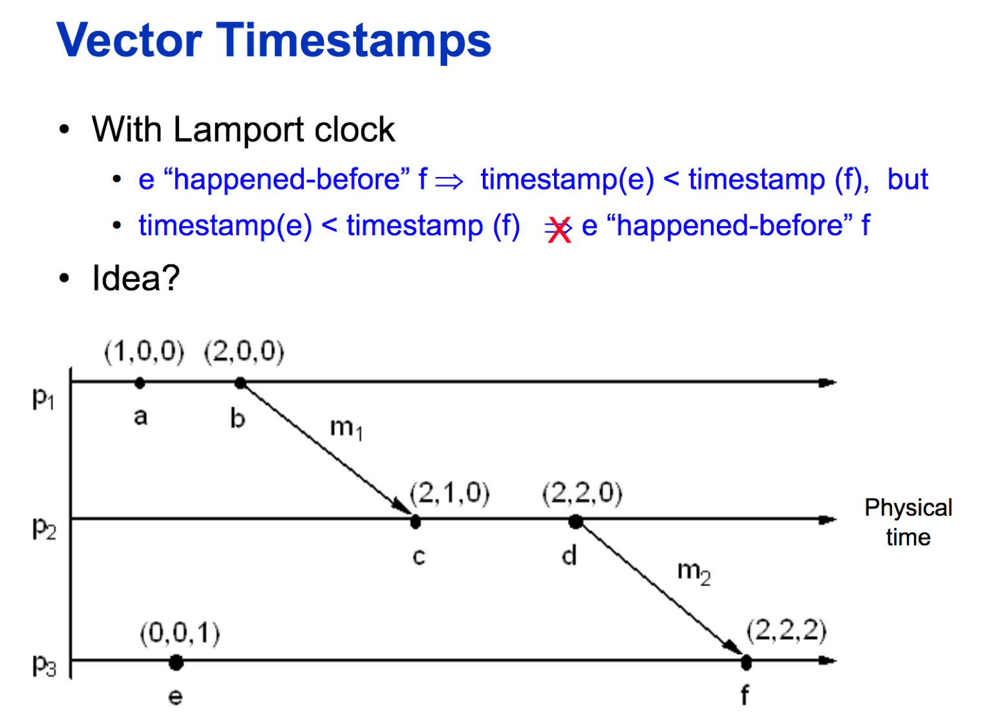

# Logical time

## Physical time
Different machine could have different phsical time

## Lamport clock
分布式系统没有全局时钟，很难给所有事件定义一个全局顺序。所以，Lamport定义了一种偏序关系  

- Lamport's Logical Clock算法如下: 
    - 每个机器本地维护一个logical clock LCi 
    - 每个机器本地每发生一个事件设置LCi = LCi + 1，并且把结果作为这个事件的logical clock。 
    - 当机器i给机器j发送消息m时，把LCi存在消息里。 
    - 当机器j收到消息m时候，LCj = max(LCj, m timestamp)+1，结果值作为收到消息m这个事件的时间戳。 

  

## Vector Clock
每个机器维护一个向量VC，也就是Vector Clock，这个向量VC有如下属性：  
1. VCi[i] 是到目前为止机器i上发生的事件的个数
2. VCi[k] 是机器i知道的机器k发生的事件的个数(即机器i对机器j的知识)

通过如下算法更新Vector Clock:  
1. 机器i本地发生一个事件时将VCi[i]加1
2. 机器i给机器j发送消息m时，将整个VCi存在消息内
3. 机器j收到消息m时，VCj[k]=max(VCj[k],VCi[k]),同时，VCj[j]+1

## Reference
- [CSE 486/586 Logical time](https://slideplayer.com/slide/8415056/)
- [吴镝 - Vector Clock/Version Clock](http://www.cnblogs.com/foxmailed/p/4985848.html)
