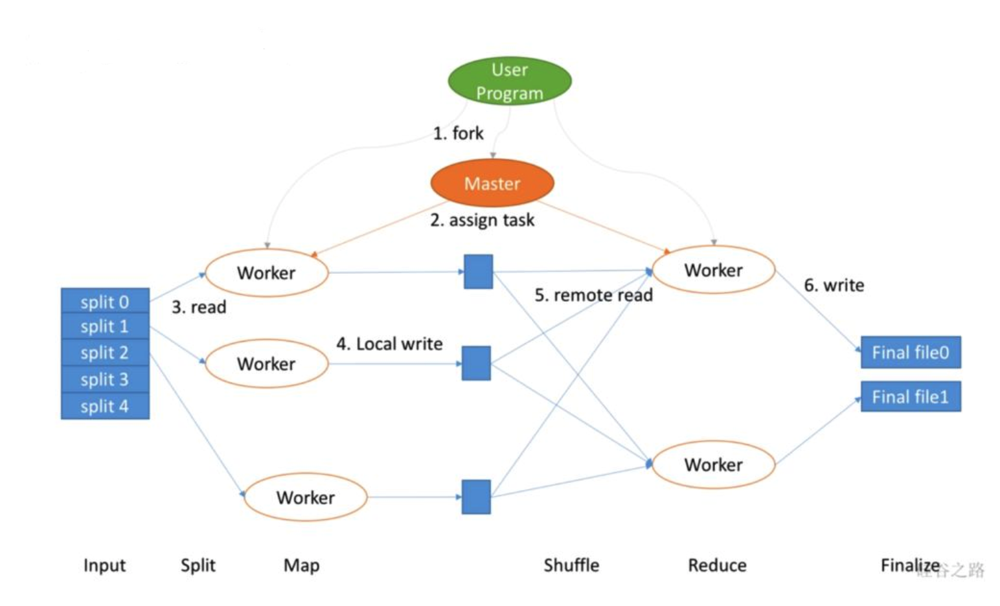
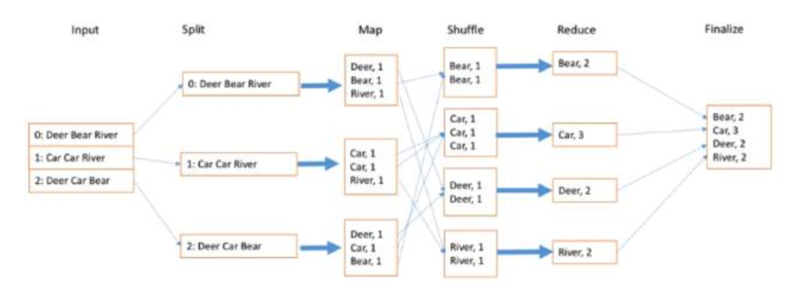
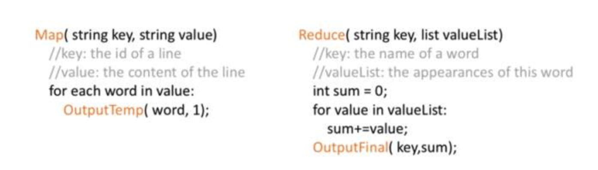
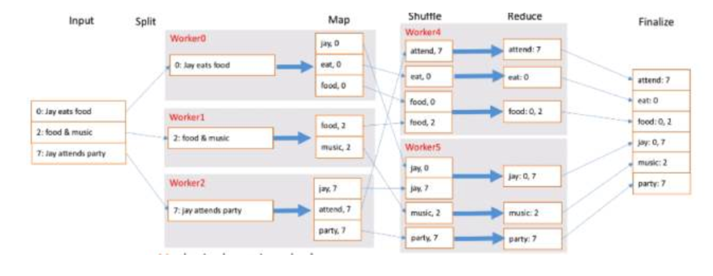
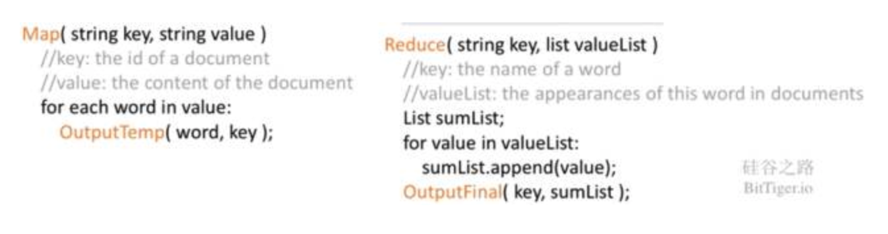

## Map Reduce's architecture

  

- User's input data be recorded in GFS, and be split into several parts
- One copy of user's program into master, others are workers.  Tasks contains M map tasks and R reduce tasks
- For each worker, when he get map task, he will handle one of the split.  Map will pass key-value in data into Map() and buffer result in the memory
- Result from map will be buffered into disk, and this will consider there will be R reducers, so will distribute them into R parts
- Reducer will get data for its part, sort data and send (key, a list of value) into reducer function
- When map reduce finished, will aggregate all result or go to next step

## Questionnaire

How MapReduce scales 

- N computers gets you Nx throughput.
    - Assuming M and R are >= N (i.e., lots of input files and map output keys).
    - Maps()s can run in parallel, since they don't interact.  Same for Reduce()s.
    - The only interaction is via the **"shuffle"** in between maps and reduces.
- So you can get more throughput by buying more computers.
    - Rather than special-purpose efficient parallelizations of each application.

How does detailed design reduce effect of slow network?

- Map input is read from GFS replica on **local disk**, not over network.
- Intermediate data goes over network just once.  Map worker writes to local disk, not GFS.
- Intermediate data partitioned into files holding many keys. (Q: Why not stream the records to the reducer (via TCP) as they are being produced by the mappers?)

How do they get good load balance?

Critical to scaling -- bad for N-1 servers to wait for 1 to finish.  But some tasks likely take longer than others.
[packing variable-length tasks into workers]
Solution: 
- many more tasks than workers.
- Master hands out new tasks to workers who finish previous tasks.
- So no task is so big it dominates completion time (hopefully).
- So faster servers do more work than slower ones, finish abt the same time.

Fault tolerance 

- what if a server crashes during a MR job?
  - MR re-runs just the failed Map()s and Reduce()s.
  - MR requires them to be pure functions:
      + they don't keep state across calls,
      + they don't read or write files other than expected MR inputs/outputs,
      + there's no hidden communication among tasks.
  - So re-execution yields the same output.
  - The requirement for pure functions is a major limitation of MR compared to other parallel programming schemes.  **But it's critical to MR's simplicity.**

- Map worker crashes
  - master sees worker no longer responds to pings
  - crashed worker's intermediate Map output is lost but is likely needed by every Reduce task!
  - master re-runs, spreads tasks over other GFS replicas of input.
  - some Reduce workers may already have read failed worker's intermediate data.
      + here we depend on functional and deterministic Map()!
  - master need not re-run Map if Reduces have fetched all intermediate data
      + though then a Reduce crash would then force re-execution of failed Map

- Reduce worker crashes.
  - finished tasks are OK -- stored in GFS, with replicas.
  - master re-starts worker's unfinished tasks on other workers.

- Reduce worker crashes in the middle of writing its output.
  - GFS has atomic rename that prevents output from being visible until complete.
  - so it's safe for the master to re-run the Reduce tasks somewhere else.

- What if the master gives two workers the same Map() task?
  - perhaps the master incorrectly thinks one worker died.  it will tell Reduce workers about only one of them.

- What if the master gives two workers the same Reduce() task?
  - they will both try to **write the same output file** on GFS!  atomic GFS rename prevents mixing; one complete file will be visible.

* What if a single worker is very slow -- a "straggler"?
  - perhaps due to flakey hardware.  master starts a second copy of last few tasks.
  
* What if a worker computes incorrect output, due to broken h/w or s/w?
  - No way! MR assumes "fail-stop" CPUs and software.

* What if the master crashes?
  - recover from check-point, or give up on job

## Examples

### Word Count

  

  

### Reverse Index

  

  

### Real world example

How might a real-world web company use MapReduce?

"CatBook", a new company running a social network for cats; needs to:
  1) build a search index, so people can find other peoples' cats
  2) analyze popularity of different cats, to decide advertising value
  3) detect dogs and remove their profiles

Can use MapReduce for all these purposes!  
run large batch jobs over all profiles every night!!  
  1) build inverted index: map(profile text) -> (word, cat_id)
                           reduce(word, list(cat_id) -> list(word, list(cat_id))
  2) count profile visits: map(web logs) -> (cat_id, "1")
                           reduce(cat_id, list("1")) -> list(cat_id, count)
  3) filter profiles: map(profile image) -> img analysis -> (cat_id, "dog!")
                      reduce(cat_id, list("dog!")) -> list(cat_id)

## More info
- [MapReduce: Simplified Data Processing on Large Clusters](https://static.googleusercontent.com/media/research.google.com/en//archive/mapreduce-osdi04.pdf)
- [MapReduce: A major step backwards](https://homes.cs.washington.edu/~billhowe/mapreduce_a_major_step_backwards.html)

