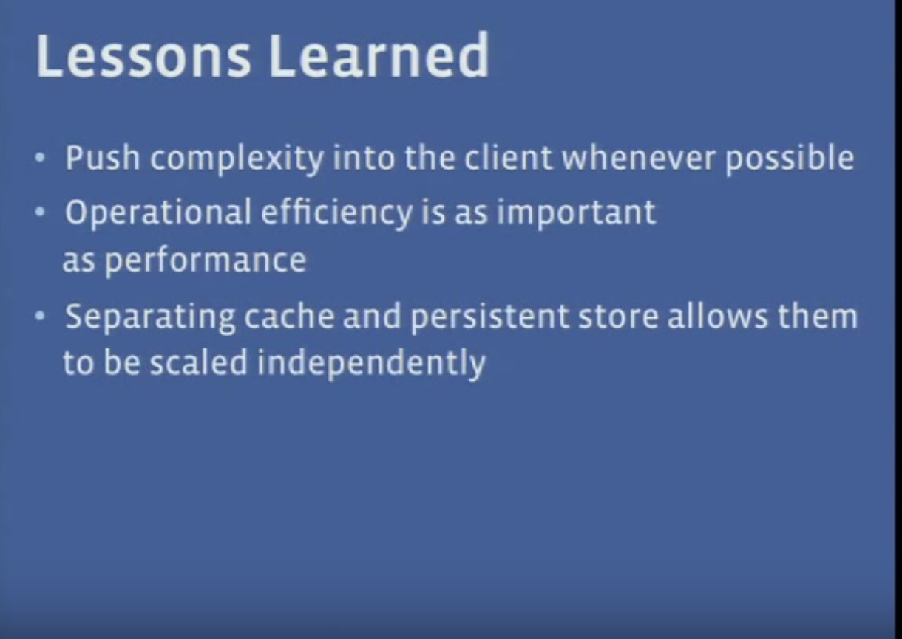

# [Scale Memcache at Facebook](https://www.youtube.com/watch?v=6phA3IAcEJ8)

## Problem to solve


  <br/>


  <br/>


  <br/>

Lots of duplicate small data + FB's app is a read dominant system   

## What is memcached


  <br/>


  <br/>

Road map: single front end cluster -> multiple front end cluster -> multiple regions


  <br/>


## Step 1: A few mem cache 

### One web server, one memcache


  <br/>


  <br/>


#### Single Server Improvement
- Allow hashtable scale automatically
- multi-thread + lock(decrease scope)
- Different thread use unique port to communication
- Use UDP not TCP
- slab allocator(pre-allocate fixed size memory block)
- Different strategy for different category of data


### Scale to multiple web servers

Similar to operating system's condition lock.  Delete will invalid lease id, server could not set value back to memcache


  <br/>

```
Issues: A updates <K,V1>, invalid cache, set key in DB(t1), then set key in cache(t2)  
        B updates same key with different value <K, V2>, invalid cache, set key in DB(t3), then set key in cache(t4)

we could only make sure that t1<t2 and t3<t4
let's sya t1 < t3, which means B set value after A, but t2 > t4, which means A set cache after B
which means we use old stale data update fresh data

```    

Issues solved by lease
- stale set, set out dated data
  - old lease id cannot cover new lease id's result
  - 每次出现 cache miss 时返回一个 lease id，每个 lease id 都只针对单条数据；
  - 当数据被删除 (write-invalidate) 时，之前发出的 lease id 失效；
  - 写入数据时，sdk 会将上次收到的 lease id 带上，memcached server 如果发现 lease id 失效，则拒绝执行；
- Thundering Herd Problem
  - 要么等待一小段时间后重试或者拿过期数据走人

  <br/>

<span style="color:blue">Thundering Herd Problem: Everyone frequent update & read data, memcache is always be invalid, then everyone will hit DB</span>  
Solution: Client wait for a while, only one request go to DB fetch data and then update cache  

Another useful optimization is **memory cache pool**, handles access pattern differences.  Some data's calculation is expensive, some is cheap; some data with high frequency and some with low. -> low-churn and high-churn

## Step 2: Many memcache server in one cluster


  <br/>

Consistent hash   

All-to-all   


  <br/>

Sliding window to control traffic


## Step 3: Many memcache in multiple clusters


  <br/>

Challenge: 
- <span style="color:blue">how to keep the caches consistent   </span>
- <span style="color:blue">how to manage over replication of data  (interesting, important, go to paper)</span>


  <br/>


Read log from mysql committed logs, detect memcache item need to be invalid, broadcast the invalid to memcache server  
Cache data must be invalid after the database operation be committed, otherwise risk to see stale data.  <span style="color:blue">How to invalid data</span>: Cluster A change the data, how to let all replication invalided the data: mcrouter  

  <br/>

Avoid fanout issue: massive amount of communication via network


  <br/>


## Step 4: Geographically distribute clusters

Single master and multiple replica

Webserver could directly write to master(few write, read dominate)
Mysql will response for transferring data
When a different web server ask for data, he don't know whether he got latest data, and if he set data back to memcache, which could result in permanent inconsistent


  <br/>

<span style="color:blue">How to avoid race condition</span>


  <br/>

During read, if the flag of "remote marker" exists, then should read from master, otherwise …


More detail:Master region:
- web server send update to database, then invalided local(in the same cluster) cache 
- web server in the same cluster meet cache miss will retrieve from master then write to cache

None master region:
Mysql update might come quite late, if using old data from mysql to replace local cache will make data inconsistent for a long while
- Say web server want to update key k
- put a mark Rk, which means this value has been updated but hasn't been sync to here
- put <k, Rk> together in SQL to master region
- remove k in local cluster
- master region get update will update, then broadcast to all remote region
- remote region get broadcast need to update all cluster's K + remove marker Rk


  <br/>

<span style="color:red">When to use memcache: fan out, 10s of billion of read on small data.  </span>
The problem cache need to fight with is strong consistency.


## More info

### Cache的几种模式(from 左耳朵耗子)

#### Cache aside
The one used in fb's memcache.  


  <br/>

- <span style="color:blue">why use delete not update</span>: **A delete is a delete. ** Avoid concurrent write generate dirt data.  ([quora](https://www.quora.com/Why-does-Facebook-use-delete-to-remove-the-key-value-pair-in-Memcached-instead-of-updating-the-Memcached-during-write-request-to-the-backend))
- <span style="color:blue">what's the issue for current fb's strategy</spna>: One request for read, miss cache, read data from database; then come to a write, write database and invalide cache; the previous operation put old value into cache and generate stale data.  But the possibility of this is very low.
- <span style="color:blue">2PC and PAXOS/RAFT is for strong consistency, why not them.</span>  2PC is too slow, PAXOS/RAFT is too complex and loose availbility.


#### Read/Write Through update strategy
Hide database in the back of cache, all operation go to cache layer and cache layer responsible for operation on database.  
More info: [wiki cache computing](https://en.wikipedia.org/wiki/Cache_(computing))


#### Write behind cache
Similar like **write back** in linux Kernel, when updating data, only update cache not database.  Cache layer will asynchronously update database with merged operations.(batch update)


## Links
- [Scaling Memcache at Facebook Paper](http://www.cs.utah.edu/~stutsman/cs6963/public/papers/memcached.pdf)
- [Scaling Memcache at Facebook By Rajesh Nishtala](https://www.youtube.com/watch?v=6phA3IAcEJ8)
- [Facebook architecture presentation: scalability challenge](https://www.slideshare.net/Mugar1988/facebook-architecture-presentation-scalability-challenge)
- Scaling Memcache in Facebook 笔记 [一](https://zhuanlan.zhihu.com/p/20734038)[二](https://zhuanlan.zhihu.com/p/20761071)[三](https://zhuanlan.zhihu.com/p/20827183)
- [Facebook 缓存技术演进：从单集群到多区域](https://xie.infoq.cn/article/fa26e97012185dfd07efa20f6)  :+1: 
- [缓存与存储的一致性策略：从 CPU 到分布式系统](https://xie.infoq.cn/article/fa1f0f9ac1cfee7845f7b29fe)