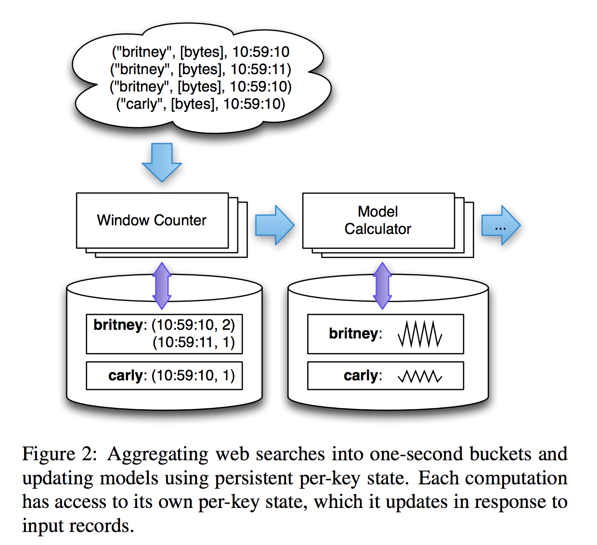

# [millwheel](https://research.google/pubs/pub41378/)

## 目标
- 数据的及时可用性 - 也就是低延迟啦，尽可能避免不必要的中间缓冲层造成的数据延迟
- 全局可用的数据持久性API - 主要用来处理各种需要数据Buffer的场合，如Window, join类操作
- **能处理乱序到达的数据** - 即数据非严格按照来源时间戳排序到达
- **保证数据满足严格一次投递(exactly-once delivery)要求** - 也就是说对应用程序而言，数据不会遗漏，也不会重复接收，减轻应用程序的实现负担
- 最大创新 `low watermark`以及 `per key storage`


## Low watermarks

why
```
(from paper)
it is important to be able to distinguish whether a flurry of expected Arabic queries at 
t = 1296167641 is simply delayed on the wire, or actually not there.
Using the low watermark, we are able to distinguish between the two example cases – if 
the low watermark advances past time t without the queries arriving, then we have high
confidence that the queries were not recorded, and are not simply delayed. 
```

Low WaterMarks: 核心思想是针对分布式环境下，各个数据来源由于网络延迟或其它种种原因，同类数据不能保证严格按照时间戳顺序到达处理节点，因此有必要知道什么时候特定时间范围的数据在处理节点上已经完全获取完毕。以保证各种依赖于时间顺序或数据完整性才能正常工作的应用的运行。

Low WaterMarks基于数据处理单元之间的数据流来定义，它标识了当前数据流中**最老的未被处理的数据包的时间戳**，也就是说它试图保证在当前数据流中，不会再产生时间戳上更老的数据包。后续的节点基于low watermarks信息就可以判断当前已接收数据是否完备。

  <br/>


Summary  
- 作用1: 最晚，要处理多晚的数据，维持一个什么样的状态
- 作用2: watermark会被上游component影响

假设有计算节点A和C，并且C是A的上游节点，则A的低水位值的计算应该遵从以下公式。  
```
low watermark of A = min (oldest work of A , low watermark of C : C outputs to A )
```


  <br/>


A的低水位值不只和A本身的最旧数据有关，也跟上游的低水位有关。因此，只要上游还有更旧的数据存在，就会通过低水位机制维护的low watermark告知下游，下游便会更新它自己的low watermark并且由于lwm timer未触发，因此会进行等待。这样就明显形成了一个递归结构，low watermark的值与数据流的Injector有一定的关联性。

  <br/>


如图所示，A的上游有C1-Cn各点，一直追溯到源头Ij1-Ijn。A中维护了一个Window，用于统计9:30-10:00这半个小时的数据，而lwm timer为10:00，由于此时A的lwm为9:50，还没有到lwm timer，因此Window不会关闭，会等待上游滞留的数据到达。lwm(A)之所以为9:50的原因是上游的数据有延迟，min(lwm of C1…Cn)=9:50。如果按照墙上时间10:30，此时早就应该触发了，便会导致结果的不准确。

- `Injectors` bring external data into MillWheel. Since injectors seed low watermark values for the rest of the pipeline, they
are able to publish an injector low watermark that propagates to any **subscribers** among their output streams, reflecting their potential deliveries along those streams.
```java
// Upon finishing a file or receiving a new
// one, we update the low watermark to be the
// minimum creation time.
void OnFileEvent() {
    int64 watermark = kint64max;
    for (file : files) {
        if (!file.AtEOF())
            watermark = min(watermark, file.GetCreationTime());
    }
    if (watermark != kint64max)
        UpdateInjectorWatermark(watermark);
}
```

## Exactly once semantic
Excellent summary from [`Jerry Peng`](https://www.splunk.com/en_us/blog/it/exactly-once-is-not-exactly-the-same.html)
```
When SPEs claim "exactly-once" processing semantics, what they’re actually saying is that 
they can guarantee that updates to state managed by the SPE are committed only once to a 
durable backend store.

 Providing "exactly-once" processing semantics really means that distinct updates to the 
 state of an operator that is managed by the stream processing engine are only reflected 
 once. "Exactly-once" by no means guarantees that processing of an event, i.e. execution 
 of arbitrary user-defined logic, will happen only once. Here at Streamlio, we prefer the 
 term effectively once for this guarantee because processing is not necessarily guaranteed 
 to occur once but the effect on the SPE-managed state is reflected once. 
```

- 每一行处理的数据都会根据每一个key做一个checkpoint，而且每一行数据只提供一次。
- MillWheel的设计是每一个事件流处理器会回报自己的最老还没处理的数据的时间戳，然后`Injector`会从每一个处理器收集最迟的时间戳。要收集最迟的时间戳因为每一个处理器的watermark应该都是一样且应该是最保守的。
- MillWheel使用Big Table/Spanner等系统作为持久化的手段，主要针对一次写，多次读这样的应用模式。ProtocolBuf -> Write Ahead Log -> LSM -> Persist


### 如何实现Exactly once

#### 分布式快照 / 状态检查点
此法受到 [`Chandy-Lamport`](https://en.wikipedia.org/wiki/Chandy%E2%80%93Lamport_algorithm) 分布式快照算法的启发。通过这种机制，流应用程序中每个算子的所有状态都会定期做 checkpoint。如果是在系统中的任何地方发生失败，每个算子的所有状态都回滚到最新的全局一致 checkpoint 点。在回滚期间，将暂停所有处理。源也会重置为与最近 checkpoint 相对应的正确偏移量。整个流应用程序基本上是回到最近一次的一致状态，然后程序可以从该状态重新启动。

  <br/>

在上图中，流应用程序在 T1 时间处正常工作，并且做了checkpoint。然而，在时间 T2，算子未能处理输入的数据。此时，S=4 的状态值已保存到持久存储器中，而状态值 S=12 保存在算子的内存中。为了修复这种差异，在时间 T3，处理程序将状态回滚到 S=4 并“重放”流中的每个连续状态直到最近，并处理每个数据。最终结果是有些数据已被处理了多次，但这没关系，因为无论执行了多少次回滚，结果状态都是相同的。

pros | cons
------------------------------|------------------------------
Little performance and resource overhead | Larger impact to performance when recovering from failures
- | Potential impact to performance increases as topology gets larger


#### 至少一次事件传递和对重复数据去重

在每个算子上实现至少一次事件传递和对重复数据去重来。使用此方法的流处理引擎将重放失败事件，以便在事件进入算子中的用户定义逻辑之前，进一步尝试处理并移除每个算子的重复事件。此机制要求为每个算子维护一个事务日志，以跟踪它已处理的事件。利用这种机制的引擎有 Google 的 MillWheel 和 Apache Kafka Streams。下图说明了这种机制的要点。

  <br/>

pros | cons
------------------------------|------------------------------
Performance impact of failures are localized | Potentially need large amounts of storage and infrastructure to support
Impact of failures does not necessarily increase with the size of the topology | Performance overhead for every event at every operator


## 数据处理模式

  <br/>


- MillWheel的数据处理单元主要对用户提供了两种数据处理的应用模式：
   + 一是按数据包三元组触发用户处理函数，就是来一个包处理一次了。比较接近Storm的概念
   + 二是按时间窗口或绝对时间（Wall time）触发用户处理函数，这种模式类似于Spark Streaming这样的小批量处理方式
   + 这两种模式也可以在一个处理单元内部混合使用，简单来说比如按数据包触发计数，然后按时间窗口触发，在特定时间间隔向下游发送计数包之类。从应用模式上来说，相对比较灵活

## Reference
- paper [en](https://static.googleusercontent.com/media/research.google.com/en//pubs/archive/41378.pdf) [ch](https://toutiao.io/posts/96aale/preview)
- [Google的大规模流式处理系统MillWheel](https://blog.csdn.net/colorant/article/details/13294741)
- [MillWheel: Google是如何在事件流处理上做到exactly one semantic的](https://zhuanlan.zhihu.com/p/30560148)
- [Exactly once is NOT exactly the same](https://www.splunk.com/en_us/blog/it/exactly-once-is-not-exactly-the-same.html) [ch](https://segmentfault.com/a/1190000019353382)
- How to implement Exponentiation [ref 1](https://www.cnblogs.com/alimayun/p/12056949.html) [ref 2](https://yq.aliyun.com/articles/53545)