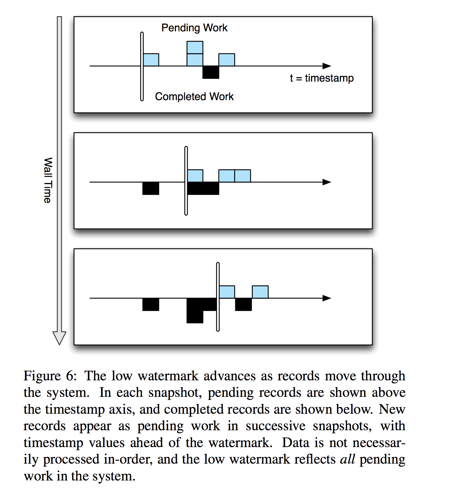
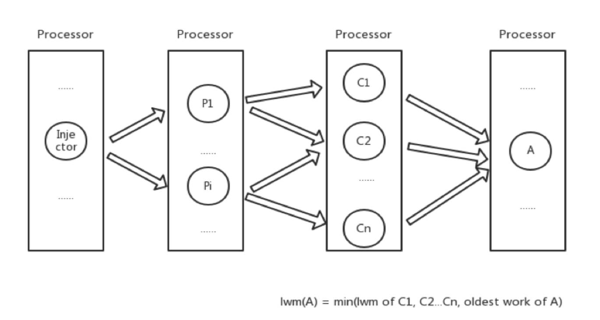
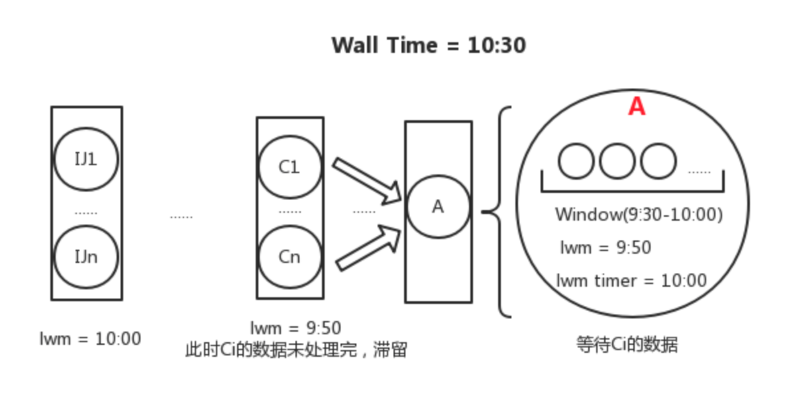

# [millwheel](https://research.google/pubs/pub41378/)

## 目标
- 数据的及时可用性 - 也就是低延迟啦，尽可能避免不必要的中间缓冲层造成的数据延迟
- 全局可用的数据持久性API - 主要用来处理各种需要数据Buffer的场合，如Window, join类操作
- **能处理乱序到达的数据** - 即数据非严格按照来源时间戳排序到达
- **保证数据满足严格一次投递(exactly-once delivery)要求** - 也就是说对应用程序而言，数据不会遗漏，也不会重复接收，减轻应用程序的实现负担
- 最大创新 `low watermark`以及 `per key storage`

## Low watermarks

Low WaterMarks: 核心思想是针对分布式环境下，各个数据来源由于网络延迟或其它种种原因，同类数据不能保证严格按照时间戳顺序到达处理节点，因此有必要知道什么时候特定时间范围的数据在处理节点上已经完全获取完毕。以保证各种依赖于时间顺序或数据完整性才能正常工作的应用的运行。

Low WaterMarks基于数据处理单元之间的数据流来定义，它标识了当前数据流中**最老的未被处理的数据包的时间戳**，也就是说它试图保证在当前数据流中，不会再产生时间戳上更老的数据包。后续的节点基于low watermarks信息就可以判断当前已接收数据是否完备。

  <br/>


Summary  
- 作用1: 最晚，要处理多晚的数据，维持一个什么样的状态
- 作用2: watermark会被上游component影响

假设有计算节点A和C，并且C是A的上游节点，则A的低水位值的计算应该遵从以下公式。  
```
low watermark of A = min (oldest work of A , low watermark of C : C outputs to A )
```


  <br/>


A的低水位值不只和A本身的最旧数据有关，也跟上游的低水位有关。因此，只要上游还有更旧的数据存在，就会通过低水位机制维护的low watermark告知下游，下游便会更新它自己的low watermark并且由于lwm timer未触发，因此会进行等待。这样就明显形成了一个递归结构，low watermark的值与数据流的Injector有一定的关联性。

  <br/>


如图所示，A的上游有C1-Cn各点，一直追溯到源头Ij1-Ijn。A中维护了一个Window，用于统计9:30-10:00这半个小时的数据，而lwm timer为10:00，由于此时A的lwm为9:50，还没有到lwm timer，因此Window不会关闭，会等待上游滞留的数据到达。lwm(A)之所以为9:50的原因是上游的数据有延迟，min(lwm of C1…Cn)=9:50。如果按照墙上时间10:30，此时早就应该触发了，便会导致结果的不准确。

## Exactly one semantic


## Reference
- paper [eng](https://static.googleusercontent.com/media/research.google.com/en//pubs/archive/41378.pdf) [cn](https://toutiao.io/posts/96aale/preview)
- [Google的大规模流式处理系统MillWheel](https://blog.csdn.net/colorant/article/details/13294741)
