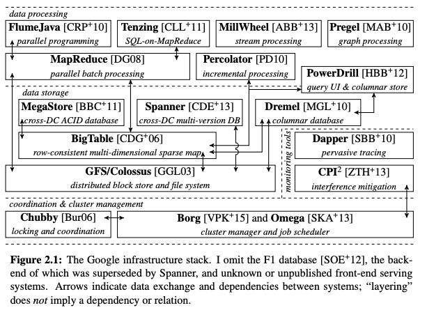
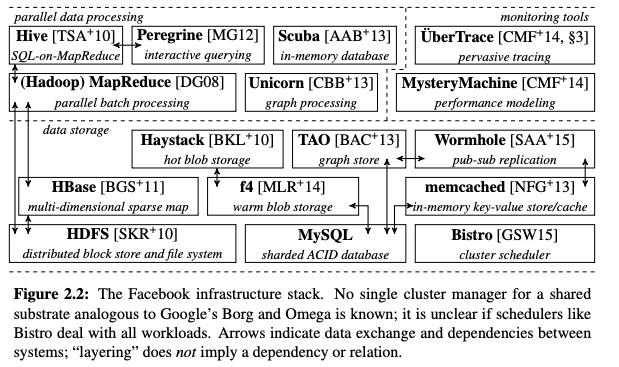

# [Operating System Support For Warehouse scale computing](https://pdfs.semanticscholar.org/3747/36b9132d852bfc1ae33c6d99b1441c1ad7fb.pdf?_ga=2.61782191.2010271702.1590290184-2131050728.1590290184)

The google infrastructure stack

   

My notes:  
- [mapreduce](./mapreduce.md)
- [gfs](./gfs.md)
- [bigtable](./bigtable.md)
- [pregel](./pregel.md)
- [chubby](./chubby.md)
- [flumejava](./flumejava.md)
- [millwheel](./millwheel.md)
- [dataflow](../lectures/dataflow_unified_model_for_batch_and_streaming.md)

The facebook infrastructure stack

   

My notes:  
- [memcache](./memcache.md)
