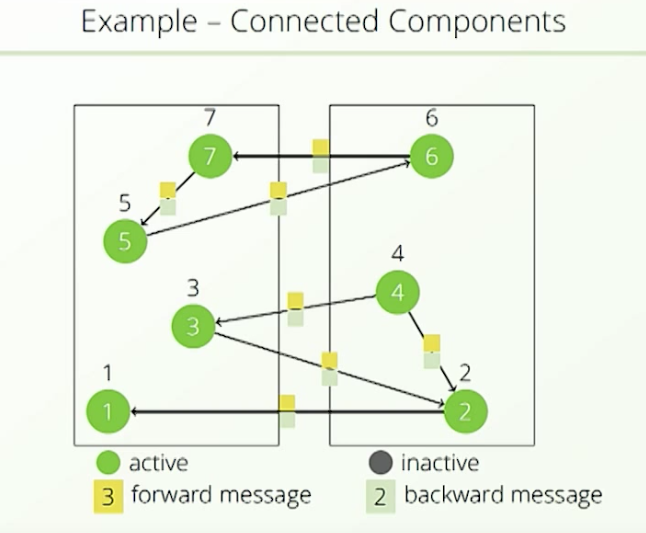
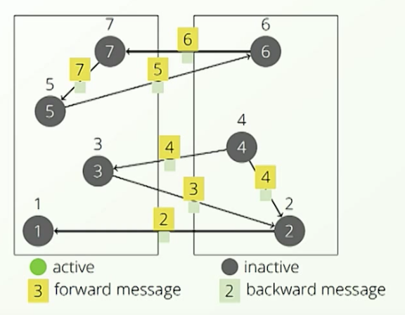
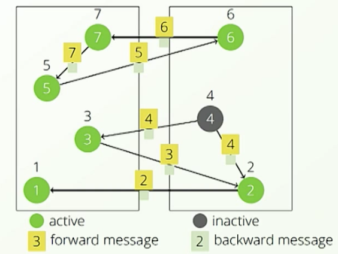
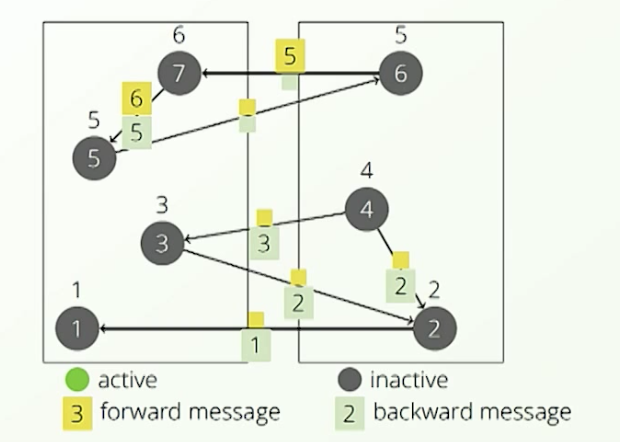
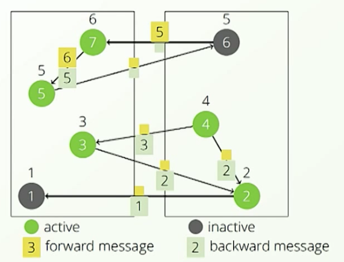
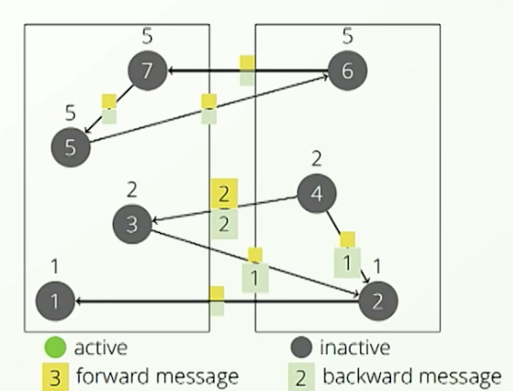
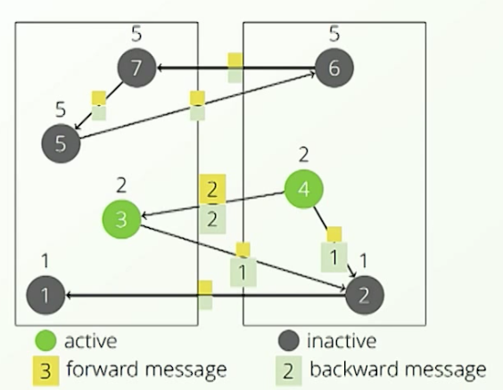
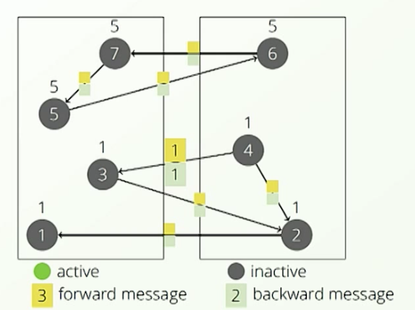

# Calculate connected component by Pregel

## Problem description

- Vertexes are recorded in different machine, they have global unique ID
- Directed graph
- Find connected components, use the smallest vertex id for component ID
  - There are two connected components, for lower one every vertex will record `1` and for upper one every vertex will record `5`

### Step 1

   

- All Vertex set to `active`
- All Vertex record its own id(put that value on top of the node)
- All Vertex send its value in `message` to connected Vertexes 

   

- Use edges to send message just recorded to his neighbors
   - Each node don't know who connected to him
- De-active, stop this round

### Step 2
- Re-active.  For nodes are active will still active, for **nodes receive message will be active**

   

- Messages has been delivered, all Vertex record min(node id sanded to him)
   - Like `6` will receive value from 5 which is smaller, so he will record `5`  

   

- Send message along side edge and against edge
   - Why along side the edge: give vertex chance to update smallest vertex id found in this round.  Like `6`, he changed his value to a smaller value, so he need send out `5`
   - Why against: Take `2`->`1` as an example.  At first `1` don't know there is `2` until 2 send message to him.  Because `2` has bigger number compare with `1`, so `1` will send message against edge back to `2`

### Step 3

- Only active the one received message.  Receive message send out in previously round.

   

- Even both `3` and `4` has already changed there value to `2`, but they don't know the change on each other side(they are on different machine), so they still need to send `2` to each other.  

   

### Step 4
   

   

- Stops when everyone is inactive.
