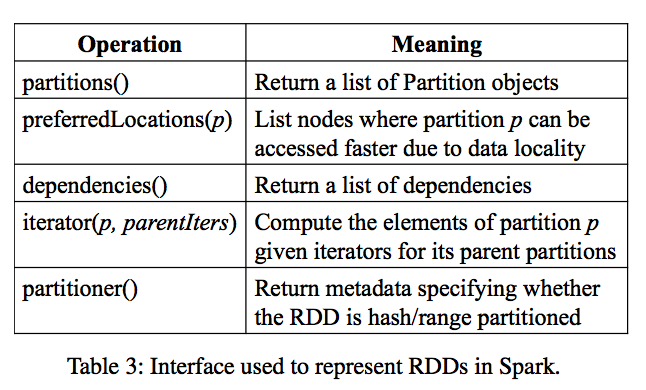
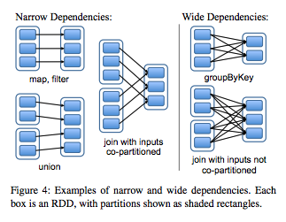
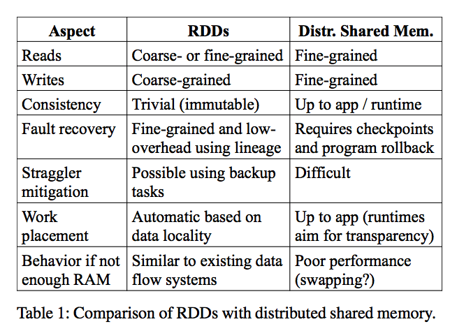

- [Resilient Distributed Datasets](#resilient-distributed-datasets)
  - [Why](#why)
  - [Pre-solutions](#pre-solutions)
  - [RDD](#rdd)
    - [Interface of RDD](#interface-of-rdd)
    - [Comments](#comments)
    - [RDD vs DSM](#rdd-vs-dsm)
    - [Fault handling](#fault-handling)
      - [Recovery from faults](#recovery-from-faults)
      - [checkpointing](#checkpointing)
    - [Example](#example)

# Resilient Distributed Datasets

Notes for [Resilient Distributed Datasets: A Fault-Tolerant Abstraction for In-Memory Cluster Computing](https://www.usenix.org/system/files/conference/nsdi12/nsdi12-final138.pdf)   

## Why

- MapReduce benefits:
   + Scales
   + Fault tolerance
   + Strategy dealing with stragglers
     * If a map task is low, MapReduce starts another task on a different machine
     * Tasks don't communicate, so easy to have them run twice in parallel
 - MapReduce limitations:
   + very rigid form of computation
   + one map phase, one level of communication between maps and reduce, and the reduce phase
   + what if you wanted to build an inverted index **and** then sort it by the most popular keyword `=>` you would need two MapReduce jobs, so, cannot properly deal with multi-stage, iterative nor interactive jobs

为什么MR会被淘汰 from [蔡元楠](https://www.linkedin.com/in/yuannancai/)
- 高昂的维护成本，尤其是当面临非常多的子任务时
- 达不到期望的性能, 复杂的配置调优: buffer size, number of shards, prefech, cache size

## Pre-solutions
- [Dryad, microsoft, 2007](https://www.microsoft.com/en-us/research/wp-content/uploads/2007/03/eurosys07.pdf).  Any directed acyclic graph, edges are communication channels, can be through disk or via TCP
    + +can implement multiple iterations
    + +can pipeline through RAM, don't have to go to disk
    + -very low level: 
        * doesn't deal with partitioning of data, want 100,000 mappers? add 100,000 nodes
        * what happens if you run out of RAM? (brief mention of "downgrading" a TCP channel to a disk file)
    + -doesn't checkpoint/replicate, in the middle of the run (so failures can be expensive)

- [Pig Latin, yahoo, 2008](http://infolab.stanford.edu/~olston/publications/sigmod08.pdf).  programming language that compiles to MapReduce
   + Adds "Database style" operators, mainly Join
       * Join: example: takes cartesian product (all tuples of combinations of v1, v2 with same k1)
       * dataset 1 (k1,v1), dataset 2 (k1, v2). ==> (k1, v1, v2)
       * dataset 1: all clicks on products on website, dataset 2: demographics (age of users), solve the problem if want average age of customer per product.
   + +allows multiple iterations
   + +can express more
   + -still has rigidness from MR (writes to disk after map, to replicated storage after reduce, RAM)


## RDD
RDD means Resilient Distributed Datasets, an RDD is a collection of partitions of records.  
```
The main challenge in designing RDDs is defining a programming interface 
that can provide fault tolerance efficiently. 
```
Basically, there are two ways: replicate the data across machines(or data checkpoint) or to log updates across machines.  Both approaches are expensive for data-intensive workloads, as they require copying large amounts of data over the cluster network, whose bandwidth is far lower than that of RAM, and they incur substantial storage overhead.  **RDDs provide an interface based on coarse-grained transformations (e.g., map, filter and join) that apply the same operation to many data items**.  

```
每个RDD都包含：
（1）一组RDD分区（partition，即数据集的原子组成部分）；
（2）对父RDD的一组依赖，这些依赖描述了RDD的Lineage；
（3）一个函数，即在父RDD上执行何种计算；
（4）元数据，描述分区模式和数据存放的位置。
例如，一个表示HDFS文件的RDD包含：各个数据块的一个分区，并知道各个数据块放在哪些节点上。
而且这个RDD上的map操作结果也具有同样的分区，map函数是在父数据上执行的。表3总结了RDD的内部接口。
```

### Interface of RDD

  <br/>


 - `partitions` -- returns a list of partitions
 - `preferredLocations(p)` -- returns the preferred locations of a partition
   + tells you about machines where computation would be faster
 - `dependencies`
   + how you depend on other RDDs
 - `iterator(p, parentIters)`
   + ask an RDD to compute one of its partitions
 - `partitioner`
   + allows you to specify a partitioning function


### Comments

- Transformations & Actions  
Two operations on RDDs:  
Transformations: compute a new RDD from existing RDDs (flatMap, reduceByKey).  This just specifies a plan. runtime is lazy, doesn't have to materialize (compute)  

  <br/>


Actions: where some effect is requested: result to be stored, get specific value, etc.  Causes RDDs to materialize.

- Fault tolerance vs performance    
Spark gives user control over trade off between fault tolerance with performance  
if user frequently persist w/REPLICATE, fast recovery, but slower execution  
if infrequently, fast execution but slow recovery  

- What partition carry metadata  
RDD carry metadata on its partitioning, so transformations that depend on multiple RDDs know whether they need to shuffle data (wide dependency) or not (narrow)
Allows users control over locality and reduces shuffles.

- What if not enough memory  
   + LRU (Least Recently Used) on partitions
        * first on non-persisted
        * then persisted (but they will be available on disk. makes sure user cannot overbook RAM)
   + user can have control on order of eviction via "persistence priority"
   + no reason not to discard non-persisted partitions (if they've already been used)


### RDD vs DSM

  <br/>


### Fault handling

When Spark computes, by default it only generates one copy of the result, doesn't replicate. Without replication, no matter if it's put in RAM or disk, if node fails, on permanent failure, data is gone.  
When some partition is lost and needs to be recomputed, the scheduler needs to find a way to recompute it. (a fault can be detected by using a heartbeat)  
will need to compute all partitions it depends on, until a partition in RAM/disk, or in replicated storage.  
if wide dependency, will need all partitions of that dependency to recompute, if narrow just one that RDD  
  
#### Recovery from faults

So two mechanisms enable recovery from faults: **lineage**, and **policy of what partitions to persist**(either to one node or replicated)  

    Lineage is represented by Transformations.  

    The user can call persist on an RDD.
      With RELIABLE flag, will keep multiple copies (in RAM if possible, disk if RAM is full)
      With REPLICATE flag, will write to stable storage (HDFS)
      Without flags, will try to keep in RAM (will spill to disk when RAM is full)

#### checkpointing
Why implement checkpointing? (it's expensive)  
Long lineage could cause large recovery time. Or when there are wide dependencies a single failure might require many partition re-computations.  

Checkpointing is like buying insurance: pay writing to stable storage so can recover faster in case of fault.  
Depends on frequency of failure and on cost of slower recovery  
An automatic checkpointing will take these into account, together with size of data (how much time it takes to write), and computation time.  
So can handle a node failure by recomputing lineage up to partitions that can be read from RAM/Disk/replicated storage.  


### Example
pagerank(todo)
