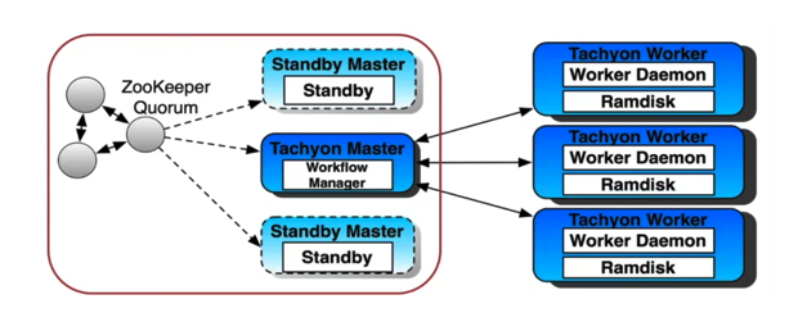

# Alluxio

[Apache Alluxio](https://www.alluxio.io/) is an open-sourced virtual distributed file system.  
Highly recommend start with [Alluxio's Lab here](./lab.md).

## General
- Alluxio target for the architecture of separating storage and calculation engine, those two components could scale separately.  Calculation engine could access different data source from Amazon S3, HDFS.
- Alluxio could manage multiple file system and using one name space to access them.  Application decoupled with data access from different data source.
- Alluxio provide file interface/structured data format, it manages metadata for related files(how many blocks, certain block on which server)

## Architecture

## Best scenario
- Alluxio acted as cache layer for Hotspot.
- Alluxio hide data access between different data access, such as from cloud provider(S3, Azure file storage) or HDFS
- Alluxio not suggest for live data processing

## More info
- [DATA ORCHESTRATION SUMMIT NOVEMBER 7, 2019](https://www.alluxio.io/data-orchestration-summit-2019/)
You could go to following links for understand what it is and what kind of thing it could do:
- [Alluxio: The Journey Thus Far and the Road ahead](https://www.infoq.com/presentations/alluxio/)
- [Building a Large-scale Interactive SQL Query Engine using Presto and Alluxio in JD.com](https://www.alluxio.io/blog/building-a-large-scale-interactive-sql-query-engine-using-presto-and-alluxio-in-jd-com/) [slides](https://conferences.oreilly.com/strata/strata-eu-2018/public/schedule/detail/64692)
- [基于Presto+Alluxio的adhoc查询方案在网易游戏的实践](https://zhuanlan.zhihu.com/p/51638076)
- [Alluxio在贝壳找房的应用](https://www.infoq.cn/article/RYYOcGqgr4voq5jJEEMT)
- [Alluxio : 开源分布式内存文件系统](https://zhuanlan.zhihu.com/p/20624086)
