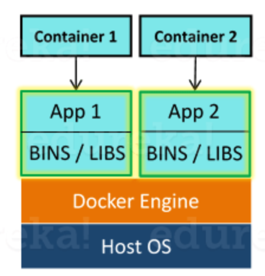
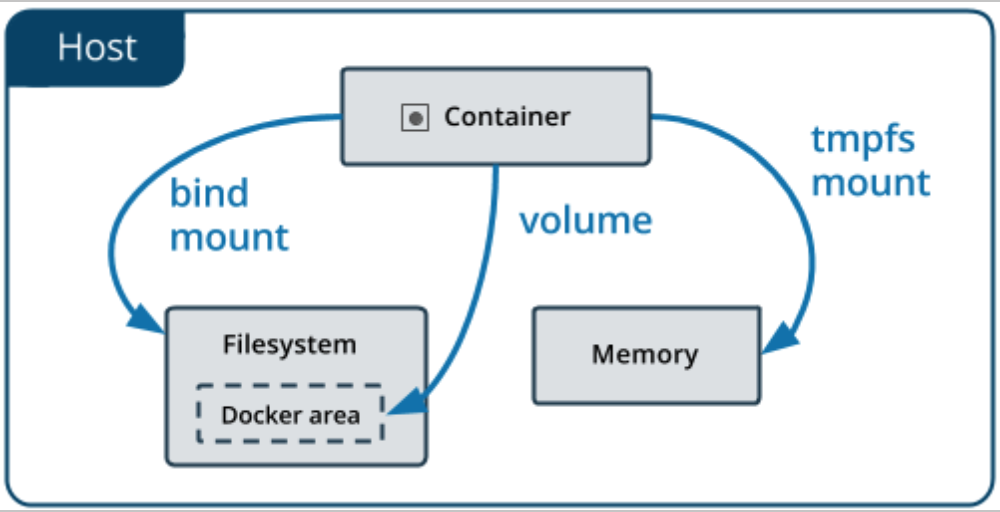

# Docker

## What is docker

- Docker is a containerization platform which packages your application and all its dependencies together in the form of containers so as to ensure that your application works seamlessly in any environment be it development or test or production.
- Docker containers, wrap a piece of software in a complete filesystem that contains everything needed to run: code, runtime, system tools, system libraries etc. anything that can be installed on a server.  
- This guarantees that the software will always run the same, regardless of its environment.  

 

## Docker commands

Purpose| Command Example | Comments
---|:---|:---
Create|docker run -t -i command name |
Check all running container | docker ps -a |
Stop | docker stop container ID |
Restart | docker restart container ID |

## Docker storage

 

http://cpp.sh/93s34  Unix clone example

