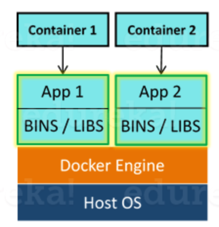
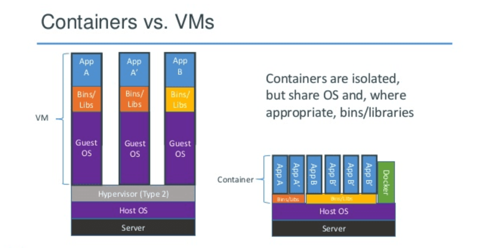
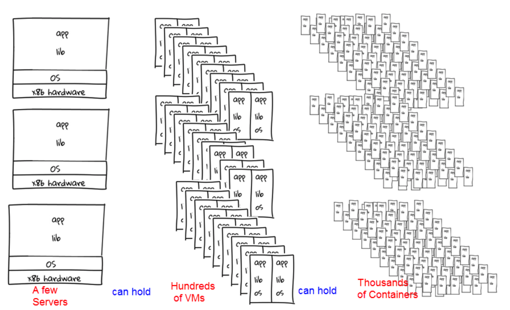
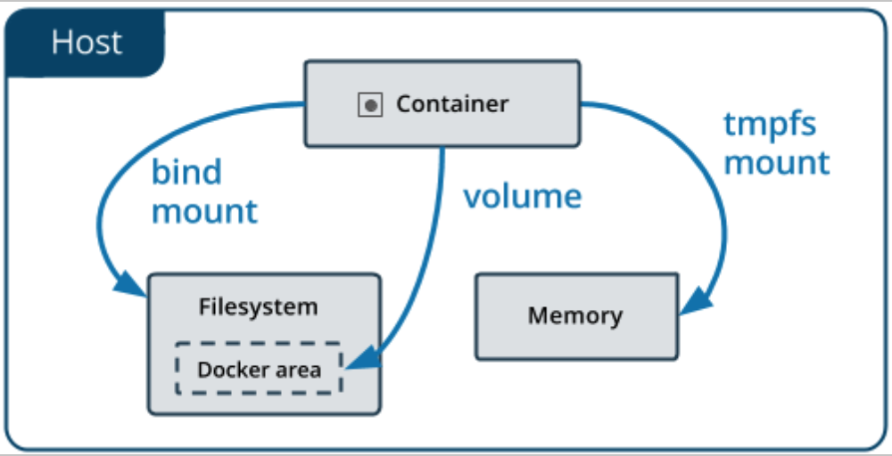

# Docker


## What is docker

- Docker is a containerization platform which packages your application and all its dependencies together in the form of containers so as to ensure that your application works seamlessly in any environment be it development or test or production.
- Docker containers, wrap a piece of software in a complete filesystem that contains everything needed to run: code, runtime, system tools, system libraries etc. anything that can be installed on a server.  
- This guarantees that the software will always run the same, regardless of its environment.  


<br/>

## Docker notes

### Docker vs VM
Docker originally used LinuX Containers (LXC), but later switched to runC (formerly known as libcontainer), which runs in the same operating system as its host. This allows it to share a lot of the host operating system resources. Also, it uses a layered filesystem (AuFS) and manages networking.  

[Linux containers](https://www.redhat.com/en/topics/containers) are technologies that allow you to package and isolate applications with their entire runtime environment—all of the files necessary to run.  This makes it easy to move the contained application between environments (dev, test, production, etc.) while retaining full functionality.   
Compare with VM, Linux containers have following advantages:
- Quick start.  Start container is just starting a process from OS, not start VM OS + process.
- Take less resources.  Container is not a complete OS, and only take needed resources.
- Smaller size.  Only take needed component while VM need entire OS.



Compare with VM, containers get less isolation, but "lightweight", smaller and faster which allows more instance running.  



AuFS is a layered file system, so you can have a read only part and a write part which are merged together. One could have the common parts of the operating system as read only (and shared amongst all of your containers) and then give each container its own mount for writing.  

More information, please go to [stackoverflow - docker vs VM](https://stackoverflow.com/questions/16047306/how-is-docker-different-from-a-virtual-machine).


### Docker files
Rules:
```
Write .dockerignore file
Container should do one thing
Understand Docker caching! Use COPY and RUN commands in proper order to utilize that.
Merge multiple RUN commands into one
Remove unneeded files after each step
Use proper base image (alpine versions should be enough)
Set WORKDIR and CMD
Use ENTRYPOINT when you have more than one command and/or need to update files using runtime data
Use exec inside entrypoint script
Prefer COPY over ADD
Specify default environment variables, ports, and volumes inside Dockerfile
```

[Best practices for writing Dockerfiles - docker doc](https://docs.docker.com/develop/develop-images/dockerfile_best-practices/)  
[How to write excellent Dockerfiles - blog](https://rock-it.pl/how-to-write-excellent-dockerfiles/) [中文](https://blog.fundebug.com/2017/05/15/write-excellent-dockerfile/)

### Docker compose
Docker Compose is a tool to streamline the definition and instantiation of multi-tier, multi-container Docker applications. 
```yml
version: "3"
      services:
          web:
               build: .
               volumes:
                   - web-data:/var/www/data
          redis:
               image: redis:alpine
               ports:
                    - "6379"
               networks:
                    - default
```
'docker-compose up' will launch all containers defined in yml file.  For more information, you could go to [compose doc]() and [compose command options](https://docs.docker.com/compose/reference/overview/), for examples you could go to [docker samples voting app](https://github.com/dockersamples/example-voting-app) or [lyft amundsen](https://github.com/lyft/amundsen/blob/master/docker-amundsen-local.yml).

### Docker storage
https://docs.docker.com/storage/volumes/  


<br/>


### Docker layers

Using a union filesystem allows each layer that is created to be reused by an unlimited number of images. This saves a lot of disk space and allows images to be built faster since it is just re-using an existing layer.  More information please go to this article [Digging into docker layers](https://medium.com/@jessgreb01/digging-into-docker-layers-c22f948ed612).


### Docker internal

http://cpp.sh/93s34  Unix clone example

## Docker commands
[docker-cheat-sheet](https://github.com/wsargent/docker-cheat-sheet)

Purpose| Command Example | Comments
---|:---|:---
Create|docker run -t -i container-name |
Check all running container | docker ps -a |
Stop | docker stop container-ID |
Restart | docker restart container-ID |
Remove all containers based on docker image name |  | [link](https://linuxconfig.org/remove-all-containners-based-on-docker-image-name)

## More Info
`basic`
- [Docker 微服务教程 阮一峰的网络日志](http://www.ruanyifeng.com/blog/2018/02/docker-tutorial.html)
- Docker 入门 云溪论坛 [part1](https://yq.aliyun.com/articles/63035) [part2](https://yq.aliyun.com/articles/63517?spm=a2c4e.11153940.blogcont63035.33.12011c3fKZ62dD)
- [How Yelp use Docker](https://engineeringblog.yelp.com/2015/08/docker-in-the-real-world-at-yelp.html)
- [Docker discussions - stackoverflow](https://stackoverflow.com/questions/tagged/docker?tab=Votes)
- [Docker 从入门到实践](https://yeasy.gitbooks.io/docker_practice/introduction/)
- [Docker 和 Kubernetes 从听过到略懂：给程序员的旋风教程](https://juejin.im/post/5b62d0356fb9a04fb87767f5)
- [medium Multistage build](https://medium.com/@tonistiigi/advanced-multi-stage-build-patterns-6f741b852fae)

`Advanced`
- [Docker基础技术：Linux Namespace（上） | | 酷 壳 - CoolShell](https://coolshell.cn/articles/17010.html)
- [Docker基础技术：Linux Namespace（下） | | 酷 壳 - CoolShell](https://coolshell.cn/articles/17029.html)
- [Docker基础技术：Linux CGroup | | 酷 壳 - CoolShell](https://coolshell.cn/articles/17049.html)
- [Docker基础技术：AUFS | | 酷 壳 - CoolShell](https://coolshell.cn/articles/17061.html)
- [Docker基础技术：DeviceMapper | | 酷 壳 - CoolShell](https://coolshell.cn/articles/17200.html)


