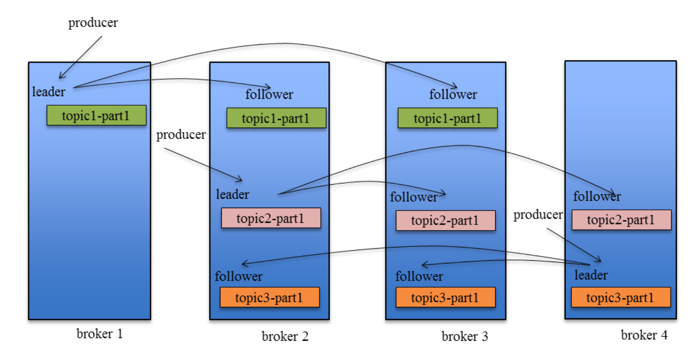

# Kafka how to reach HA

## Replicas

- There could be multiple `replicas` for each `partition`, one of them is `leader`, others are `follower`
- Only `leader` is responsible for handling request and response, `follower` just for backup
- Terms
  - `AR`
  - `ISR` in sync replica `OSR` out sync replica
  - `HW` high watermark


### Distribute replicas to different brokers

一个 Topic 的 Partition 数量大于 Broker 的数量。同时为了提高 Kafka 的容错能力，也需要将同一个 Partition 的 Replica 尽量分散到不同的机器。

```
kafka 分配 Replica 的算法如下：
1. 将所有 Broker（假设共 n 个 Broker）和待分配的 Partition 排序
2. 将第 i 个 Partition 分配到第（i mod n）个 Broker 上
3. 将第 i 个 Partition 的第 j 个 Replica 分配到第（(i + j) mode n）个 Broker 上 
```

<br/>


