# Kafka 设计解析 Notes
By 郭俊

## links

https://www.infoq.cn/article/kafka-analysis-part-1  
https://www.infoq.cn/article/kafka-analysis-part-2  
https://www.infoq.cn/article/kafka-analysis-part-3  
https://www.infoq.cn/article/kafka-analysis-part-4  
https://www.infoq.cn/article/kafka-analysis-part-5  
https://www.infoq.cn/article/kafka-analysis-part-6  
https://www.infoq.cn/article/kafka-analysis-part-7  
https://www.infoq.cn/article/kafka-analysis-part-8  

## Terminology
- **Broker** Kafka 集群包含一个或多个服务器，这种服务器被称为 broker
- **Topic** 每条发布到 Kafka 集群的消息都有一个类别，这个类别被称为 Topic。（物理上不同 Topic 的消息分开存储，逻辑上一个 Topic 的消息虽然保存于一个或多个 broker 上但用户只需指定消息的 Topic 即可生产或消费数据而不必关心数据存于何处）
- **Partition** Partition 是物理上的概念，每个 Topic 包含一个或多个 Partition.
- **Producer** 负责发布消息到 Kafka broker
- **Consumer** 消息消费者，向 Kafka broker 读取消息的客户端。
- **Consumer Group** 每个 Consumer 属于一个特定的 Consumer Group（可为每个 Consumer 指定 group name，若不指定 group name 则属于默认的 group）

## Kafka 拓扑结构

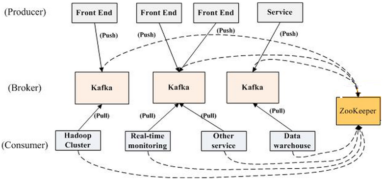
<br/>

## Topic & partition

Topic 在逻辑上可以被认为是一个 queue，每条消费都必须指定它的 Topic，可以简单理解为必须指明把这条消息放进哪个 queue 里。为了使得 Kafka 的吞吐率可以线性提高，物理上把 Topic 分成一个或多个 Partition，每个 Partition 在物理上对应一个文件夹，该文件夹下存储这个 Partition 的所有消息和索引文件。若创建 topic1 和 topic2 两个 topic，且分别有 13 个和 19 个分区，则整个集群上会相应会生成共 32 个文件夹（本文所用集群共 8 个节点，此处 topic1 和 topic2 replication-factor 均为 1），如下图所示。

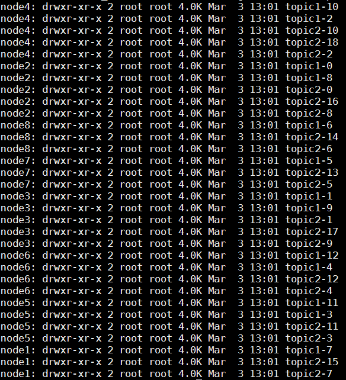
<br/>
每个日志文件都是一个 log entrie 序列，每个 log entrie 包含一个 4 字节整型数值（值为 N+5），1 个字节的 "magic value"，4 个字节的 CRC 校验码，其后跟 N 个字节的消息体。每条消息都有一个当前 Partition 下唯一的 64 字节的 offset，它指明了这条消息的起始位置。磁盘上存储的消息格式如下：

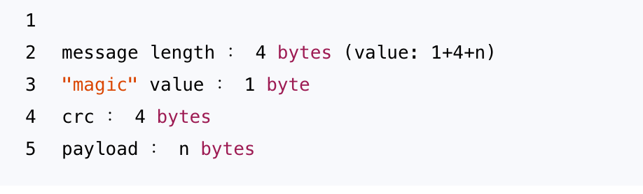
<br/>
这个 log entries 并非由一个文件构成，而是分成多个 segment，每个 segment 以该 segment 第一条消息的 offset 命名并以“.kafka”为后缀。另外会有一个索引文件，它标明了每个 segment 下包含的 log entry 的 offset 范围，如下图所示。
kafka_design_guojun_segment

因为每条消息都被 append 到该 Partition 中，属于顺序写磁盘，因此效率非常高（经验证，顺序写磁盘效率比随机写内存还要高，这是 Kafka 高吞吐率的一个很重要的保证）。

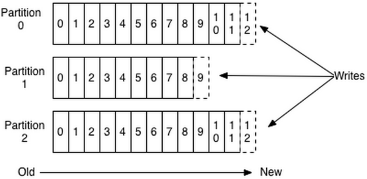
<br/>

对于传统的 message queue 而言，一般会删除已经被消费的消息，而 Kafka 集群会保留所有的消息，无论其被消费与否。当然，因为磁盘限制，不可能永久保留所有数据（实际上也没必要），因此 Kafka 提供两种策略删除旧数据:一是基于时间，二是基于 Partition 文件大小


因为 offet 由 Consumer 控制，**所以 Kafka broker 是无状态的**，它不需要标记哪些消息被哪些消费过，也不需要通过 broker 去保证同一个 Consumer Group 只有一个 Consumer 能消费某一条消息，因此也就不需要锁机制

## Producer 消息路由

Producer 发送消息到 broker 时，会根据 partition 机制选择将其存储到哪一个 Partition。如果 Partition 机制设置合理，所有消息可以均匀分布到不同的 Partition 里，这样就实现了负载均衡。如果一个 Topic 对应一个文件，那这个文件所在的机器 I/O 将会成为这个 Topic 的性能瓶颈，而有了 Partition 后，不同的消息可以并行写入不同 broker 的不同 Partition 里，极大的提高了吞吐率。可以在 $KAFKA_HOME/config/server.properties 中通过配置项 num.partitions 来指定新建 Topic 的默认 Partition 数量，也可在创建 Topic 时通过参数指定，同时也可以在 Topic 创建之后通过 Kafka 提供的工具修改。

在发送一条消息时，可以指定这条消息的 key，Producer 根据这个 key 和 Partition 机制来判断应该将这条消息发送到哪个 Partition。Paritition 机制可以通过指定 Producer 的 partition. class 这一参数来指定，该 class 必须实现 kafka.producer.Partitioner 接口

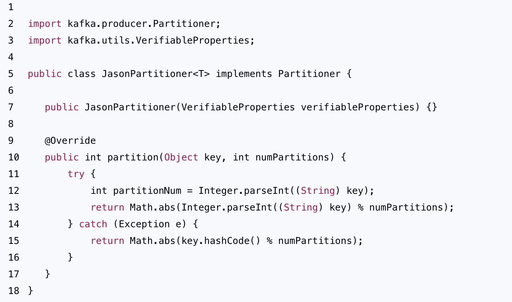
<br/>

## Consumer Group


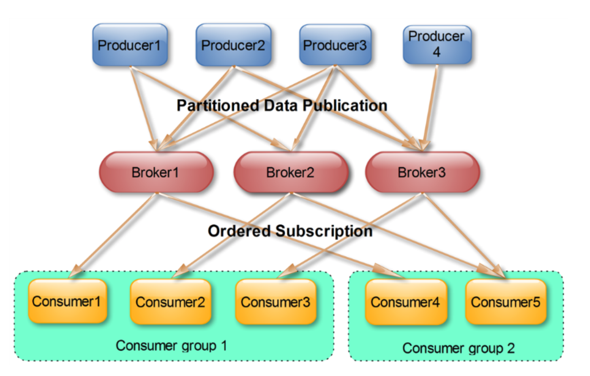
<br/>

(from [link](https://www.cnblogs.com/huxi2b/p/6223228.html))  
- consumer group下可以有一个或多个consumer instance，consumer instance可以是一个进程，也可以是一个线程
- group.id是一个字符串，唯一标识一个consumer group
- consumer group下订阅的topic下的每个分区只能分配给某个group下的一个consumer(当然该分区还可以被分配给其他group)


## Push vs Pull
**pull 模式则可以根据 Consumer 的消费能力以适当的速率消费消息**

## Kafka Delivery guarantee

规则
- At most once 消息可能会丢，但绝不会重复传输
- At least one 消息绝不会丢，但可能会重复传输
- Exactly once 每条消息肯定会被传输一次且仅传输一次，很多时候这是用户所想要的。


• 当 Producer 向 broker 发送消息时，一旦这条消息被 commit，因数 replication 的存在，它就不会丢。但是如果 Producer 发送数据给 broker 后，遇到网络问题而造成通信中断，那 Producer 就无法判断该条消息是否已经 commit。虽然 Kafka 无法确定网络故障期间发生了什么，但是 Producer 可以生成一种类似于主键的东西，发生故障时幂等性的重试多次，这样就做到了 Exactly once。截止到目前 (Kafka 0.8.2 版本，2015-03-04)，这一 Feature 还并未实现，有希望在 Kafka 未来的版本中实现。（所以目前默认情况下一条消息从 Producer 到 broker 是确保了 At least once，可通过设置 Producer 异步发送实现 At most once）。

• 接下来讨论的是消息从 broker 到 Consumer 的 delivery guarantee 语义。（仅针对 Kafka consumer high level API）。Consumer 在从 broker 读取消息后，可以选择 commit，该操作会在 Zookeeper 中保存该 Consumer 在该 Partition 中读取的消息的 offset。该 Consumer 下一次再读该 Partition 时会从下一条开始读取。如未 commit，下一次读取的开始位置会跟上一次 commit 之后的开始位置相同。当然可以将 Consumer 设置为 autocommit，即 Consumer 一旦读到数据立即自动 commit。如果只讨论这一读取消息的过程，那 Kafka 是确保了 Exactly once。但实际使用中应用程序并非在 Consumer 读取完数据就结束了，而是要进行进一步处理，而数据处理与 commit 的顺序在很大程度上决定了消息从 broker 和 consumer 的 delivery guarantee semantic。

• 读完消息先 commit 再处理消息。这种模式下，如果 Consumer 在 commit 后还没来得及处理消息就 crash 了，下次重新开始工作后就无法读到刚刚已提交而未处理的消息，这就对应于 At most once

• 读完消息先处理再 commit。这种模式下，如果在处理完消息之后 commit 之前 Consumer crash 了，下次重新开始工作时还会处理刚刚未 commit 的消息，实际上该消息已经被处理过了。这就对应于 At least once。在很多使用场景下，消息都有一个主键，所以消息的处理往往具有幂等性，即多次处理这一条消息跟只处理一次是等效的，那就可以认为是 Exactly once。（笔者认为这种说法比较牵强，毕竟它不是 Kafka 本身提供的机制，主键本身也并不能完全保证操作的幂等性。而且实际上我们说 delivery guarantee 语义是讨论被处理多少次，而非处理结果怎样，因为处理方式多种多样，我们不应该把处理过程的特性——如是否幂等性，当成 Kafka 本身的 Feature）

• 如果一定要做到 Exactly once，就需要协调 offset 和实际操作的输出。**精典的做法是引入两阶段提交**。如果能让 offset 和操作输入存在同一个地方，会更简洁和通用


Discussion on hacker news:
https://news.ycombinator.com/item?id=9266725

Exactly-once Semantics are Possible: Here’s How Kafka Does it
https://www.confluent.io/blog/exactly-once-semantics-are-possible-heres-how-apache-kafka-does-it/

A broker could fail
The producer to broker rpc can fail
The client can fail

Prior to 0.11.x, Apache Kafka supported at-least once delivery semantics and in-order delivery per partition. As you can tell from the example above, that means producer retries can cause duplicate messages.

Like TCP, assign unique seq number, then dedup at kafka size
Transactions, commit, 2pc
Building on idempotency and atomicity, exactly-once stream processing is now possible through the Streams API in Apache Kafka.

Let me explain that in a little more detail. The critical question for a stream processing system is “does my stream processing application get the right answer, even if one of the instances crashes in the middle of processing?” The key, when recovering a failed instance, is to resume processing in exactly the same state as before the crash.

Now, stream processing is nothing but a read-process-write operation on a Kafka topic; a consumer reads messages from a Kafka topic, some processing logic transforms those messages or modifies state maintained by the processor, and a producer writes the resulting messages to another Kafka topic. Exactly-once stream processing is simply the ability to execute a read-process-write operation exactly one time. In this case, “getting the right answer” means not missing any input messages or producing any duplicate output. This is the behavior users expect from an exactly-once stream processor.


There are many other failure scenarios to consider besides the simple one we’ve discussed so far:

	• The stream processor might take input from multiple source topics, and the ordering across these source topics is not deterministic across multiple runs. So if you re-run your stream processor that takes input from multiple source topics, it might produce different results.


	• Likewise the stream processor might produce output to multiple destination topics. If the producer cannot do an atomic write across multiple topics, then the producer output can be incorrect if writes to some (but not all) partitions fail.


	• The stream processor might aggregate or join data across multiple inputs using the managed state facilities the Streams API provides. If one of the instances of the stream processor fails, then you need to be able to rollback the state materialized by that instance of the stream processor. On restarting the instance, you also need to be able to resume processing and recreate its state.


	• The stream processor might look up enriching information in an external database or by calling out to a service that is updated out of band. Depending on an external service makes the stream processor fundamentally non-deterministic; if the external service changes its internal state between two runs of the stream processor, it leads to incorrect results downstream. However, if handled correctly, this should not lead to entirely incorrect results. It should just lead to the stream processor output belonging to a set of legal outputs. More on this later in the blog.


Failure and restart, especially when combined with non-deterministic operations and changes to the persistent state computed by the application, may result not only in duplicates but in incorrect results. 

 It refers to consuming from a topic, materializing intermediate state in a Kafka topic and producing to one, not all possible computations done on a message using the Streams API. 


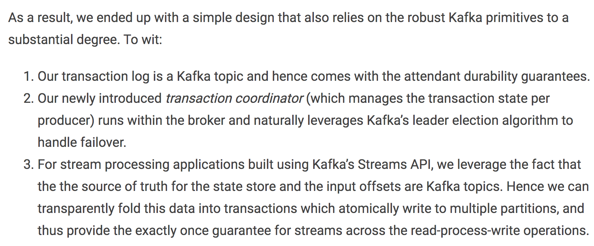
<br/>

Design doc
https://docs.google.com/document/d/11Jqy_GjUGtdXJK94XGsEIK7CP1SnQGdp2eF0wSw9ra8/edit#heading=h.xq0ee1vnpz4o

Implementation:
https://cwiki.apache.org/confluence/display/KAFKA/KIP-98+-+Exactly+Once+Delivery+and+Transactional+Messaging
https://cwiki.apache.org/confluence/display/KAFKA/KIP-129%3A+Streams+Exactly-Once+Semantics


Idempotent Producer
https://cwiki.apache.org/confluence/display/KAFKA/Idempotent+Producer

Transactional Messaging in Kafka
https://cwiki.apache.org/confluence/display/KAFKA/Transactional+Messaging+in+Kafka


## Kafka High Availability

为了更好的做负载均衡，Kafka 尽量将所有的 Partition 均匀分配到整个集群上。一个典型的部署方式是一个 Topic 的 Partition 数量大于 Broker 的数量。同时为了提高 Kafka 的容错能力，也需要将同一个 Partition 的 Replica 尽量分散到不同的机器。实际上，如果所有的 Replica 都在同一个 Broker 上，那一旦该 Broker 宕机，该 Partition 的所有 Replica 都无法工作，也就达不到 HA 的效果。

```
kafka 分配 Replica 的算法如下：
	1. 将所有 Broker（假设共 n 个 Broker）和待分配的 Partition 排序
	2. 将第 i 个 Partition 分配到第（i mod n）个 Broker 上
    3. 将第 i 个 Partition 的第 j 个 Replica 分配到第（(i + j) mode n）个 Broker 上 
```


<br/>

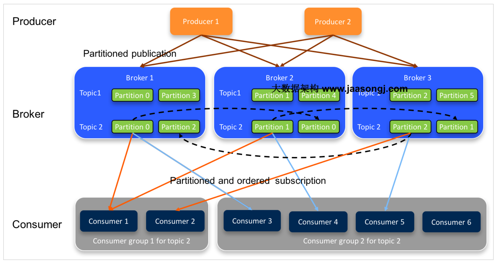
<br/>

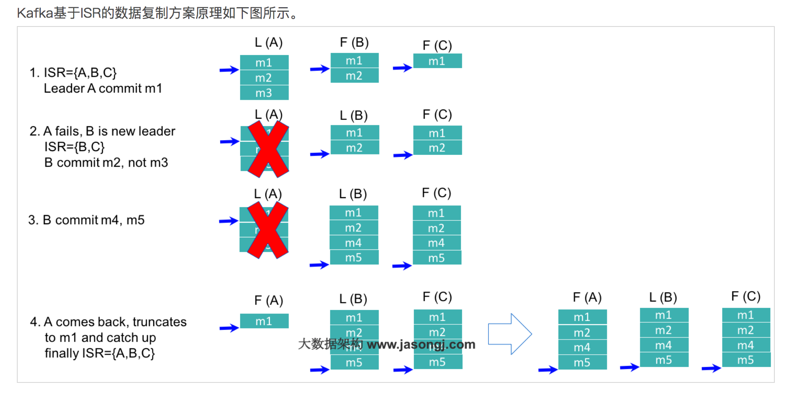
<br/>
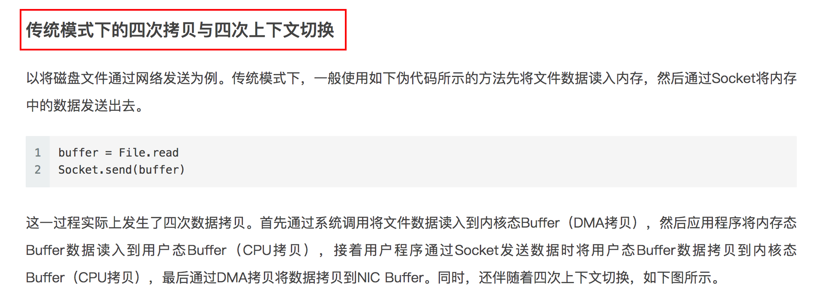
<br/>


<br/>

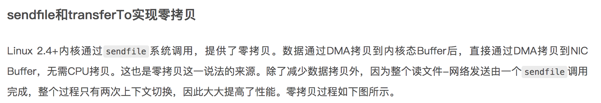
<br/>

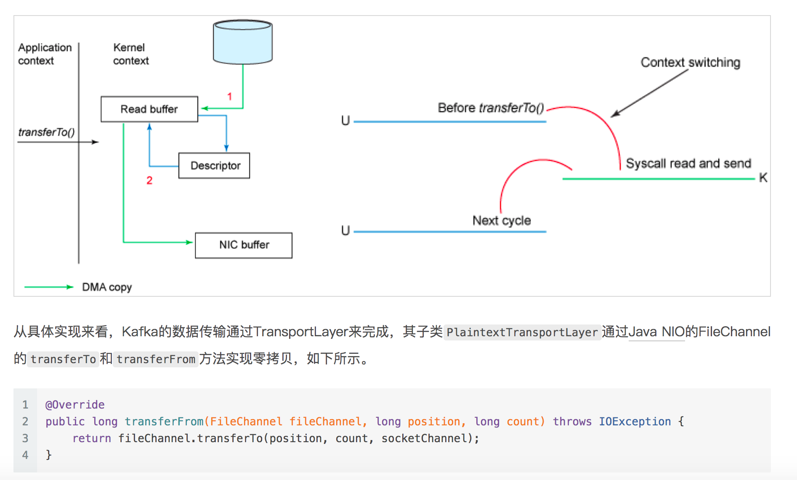
<br/>

## 流式计算的新贵 Kafka Stream


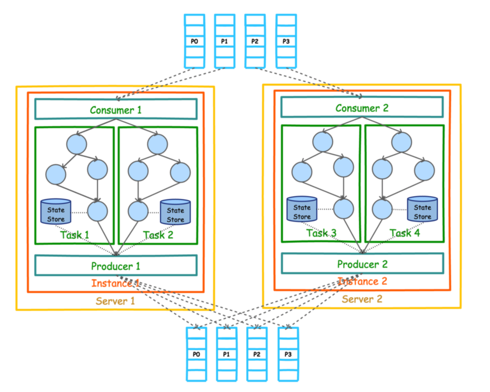
<br/>

## processor topology
基于 Kafka Stream 的流式应用的业务逻辑全部通过一个被称为 Processor Topology 的地方执行。它与 Storm 的 Topology 和 Spark 的 DAG 类似，都定义了数据在各个处理单元（在 Kafka Stream 中被称作 Processor）间的流动方式，或者说定义了数据的处理逻辑

### ktable vs kstream
KStream 是一个数据流，可以认为所有记录都通过 Insert only 的方式插入进这个数据流里。而 KTable 代表一个完整的数据集，可以理解为数据库中的表。由于每条记录都是 Key-Value 对，这里可以将 Key 理解为数据库中的 Primary Key，而 Value 可以理解为一行记录。可以认为 KTable 中的数据都是通过 Update only 的方式进入的。也就意味着，如果 KTable 对应的 Topic 中新进入的数据的 Key 已经存在，那么从 KTable 只会取出同一 Key 对应的最后一条数据，相当于新的数据更新了旧的数据。  

CDC or final result  
