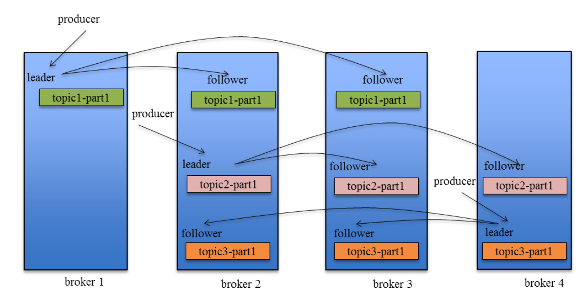

# Kafka how to reach HA

## Replicas

- There could be multiple `replicas` for each `partition`, one of them is `leader`, others are `follower`
- Only `leader` is responsible for handling request and response, `follower` just for backup
- Terms
  - `AR` assigned replicas
  - `ISR` in sync replica `OSR` out sync replica
  - `HW` high watermark


***

### Distribute replicas to different brokers

一个 Topic 的 Partition 数量大于 Broker 的数量。同时为了提高 Kafka 的容错能力，也需要将同一个 Partition 的 Replica 尽量分散到不同的机器。

```
kafka 分配 Replica 的算法如下：
1. 将所有 Broker（假设共 n 个 Broker）和待分配的 Partition 排序
2. 将第 i 个 Partition 分配到第（i mod n）个 Broker 上
3. 将第 i 个 Partition 的第 j 个 Replica 分配到第（(i + j) mode n）个 Broker 上 
```

<br/>

***

### Leader switch

- When the broker contains leader is down, need to chose another `replica` as leader
  - How to choose `follower`
     + Due to previous algorithm, if we randomly choose a `broker`, its possible to make that `broker` has more than two `leaders`, which might increase load and cause instability
     +  `preferred replica`, kafka makes sure the even distribution of `preferred replica` in Kafka cluster
     +  `Demon` task to calculate each `broker`'s load
  - `rebalanced` when new broker be added into cluster, how to move existing `leader` to here
     + [`kafka-reassign-partitions.sh`](https://docs.cloudera.com/runtime/7.2.1/kafka-managing/topics/kafka-manage-cli-reassign-overview.html)
         + create a JSON file which contains topic list
         + Generate a rebalance proposal based on topic list/broker nodes list
         + Execute


<br/>

***

### Sync between Leader and Follower


<br/>

- pos1: Leader's LEO is updated when new message has been written into `WAL`
- pos3: Follower's LEO is updated when following conditions have be met all
  - send `FETCH` command to leader side
  - leader side has new message be written and send in the response
  - Follower side write data into its own `WAL`, LEO += 1
- pos4: after `FETCH` from leader, follower's HW = min(Leader's HW, follower's LEO)
- pos5: pos5 is updated after follower's `FETCH`, will use follower's old `LEO` before follower update any data from Leader
- pos2: Leader's HW = min(Leader's LEO, all Follower's LEO(such as pos5 in the upper))

Major problem:
- Leader update HW based on next round's `FETCH`
   + Let's say currently, every one is all synced with 1 message
   + Leader get new message, update its LEO to 2
   + Follower `FETCH` from server, Follower update its LEO to 2, currently, HW is 1 for all of them and LEO for follower on server side is 1
   + For next `FETCH`, server update follower's LEO and then update server's HW to 2
   + For next `FETCH`, follower update its HW to 2

Data Loss  


<br/>

Data unsync  


<br/>


Solution: LeaderEpoch  
- Leader epoch is a pair of value (epoch, offset), epoch is leader's version number, start from 0, each time when leader changes will +1, offset means offset of first message for this version of leader
- Leader broker will keep such cache, and regularly writtern into checkpoint file(zookeeper??)


<br/>


<br/>

#### why not consensus protocol


<br/>

***

### Important parameters in Producer

- ACK
  - `acks=1`, as long as leader replica successfully write the message
  - `acks=0`, no need to wait for server side's response
  - `ack=-1`, after producer send message, need to wait for all replicas in ISR to successfully write the message
- retries and retry.backoff.ms


***

### Disk sync speed
Not recommend to set this, HA is reached by multiple replica.

## More info
- [Kafka水位(high watermark)与leader epoch的讨论](https://www.cnblogs.com/huxi2b/p/7453543.html)