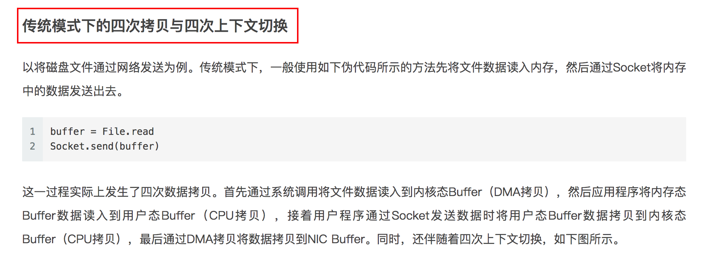

# The secret behind Kafka's performance

## Write ahead long

## Keep sequence

## Window and trigger

## Sendfile

[`SendFile`](https://zhuanlan.zhihu.com/p/78335525)   

 

 

 

 

## Network optimization

 

image from: [Kafka 处理请求的全流程解析](https://xie.infoq.cn/article/51b8d97925e0a7303ff831a81)

