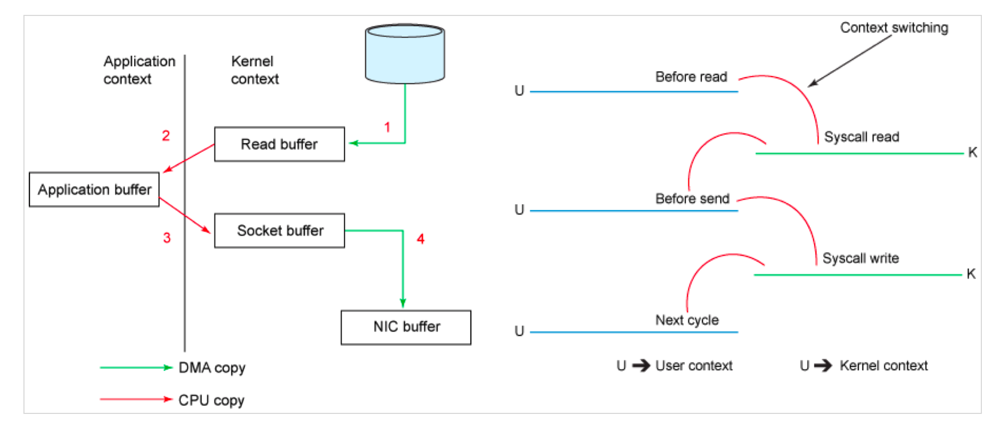

# The secret behind Kafka's performance

*** 
## Write ahead long

*** 

## Keep sequence

*** 

## Window and trigger

*** 

## Sendfile

[`SendFile`](https://zhuanlan.zhihu.com/p/78335525)   

 

 

 

 

*** 

## Network optimization

 

image from: [Kafka 处理请求的全流程解析](https://xie.infoq.cn/article/51b8d97925e0a7303ff831a81)

Kafka socket server  

目的: 接收客户端Socket请求连接、处理请求并返回处理结果的核心类，Acceptor及Processor的初始化、处理逻辑都是在这里实现的  

逻辑: startup的初始化方法，会初始化1个 Acceptor和N个Processor线程

https://github.com/apache/kafka/blob/1f98112e993bc4ae098936b1b0661fdb2c4b1880/core/src/main/scala/kafka/network/SocketServer.scala#L76

Acceptor

https://github.com/apache/kafka/blob/9689a313f52a7b45f38faecddf018dc8ab02dc62/core/src/main/scala/kafka/network/SocketServer.scala#L539:22

调用处

https://github.com/apache/kafka/blob/9689a313f52a7b45f38faecddf018dc8ab02dc62/core/src/main/scala/kafka/network/SocketServer.scala#L275

