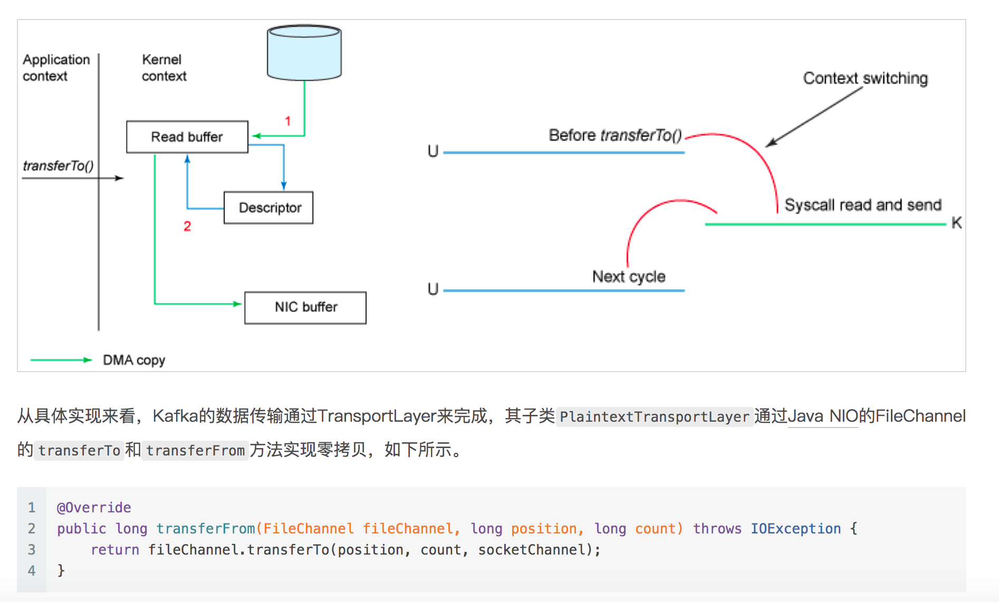

# The secret behind Kafka's performance

## Write ahead long

## Keep sequence

## Window and trigger

## Sendfile

[`SendFile`](https://zhuanlan.zhihu.com/p/78335525)   

 

 

 

 

## Network optimization

