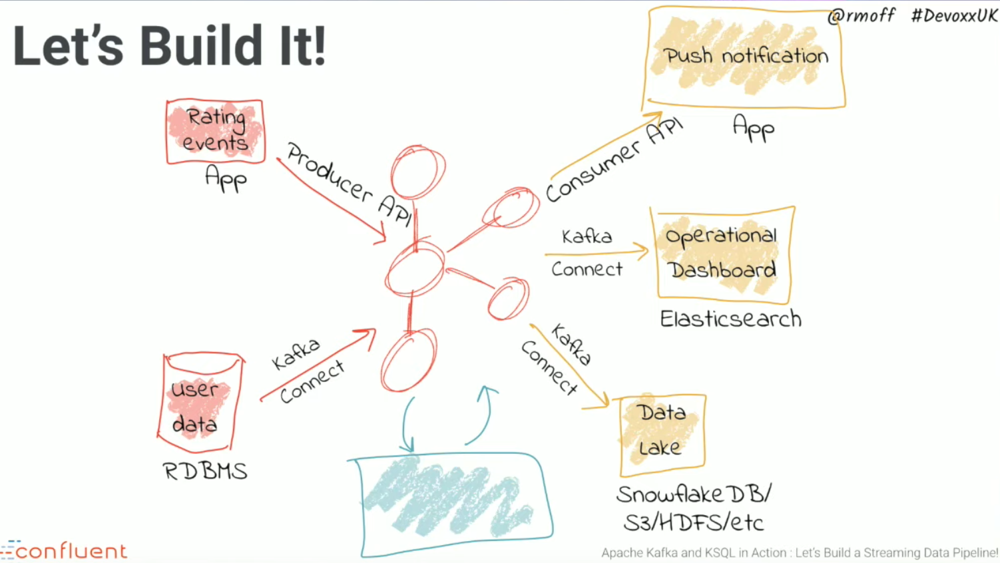

# KSQL workshop

Apache Kafka and KSQL in Action

[video](https://www.youtube.com/watch?v=Z8_O0wEIafw) [slides](https://speakerdeck.com/rmoff/javazone-workshop-apache-kafka-and-ksql-in-action-lets-build-a-streaming-data-pipeline) [code](https://github.com/confluentinc/demo-scene/tree/master/ksql-workshop) [wiki](https://github.com/confluentinc/demo-scene/blob/master/ksql-workshop/ksql-workshop.adoc)


<br/>


The result of topic inside ksql

```
PRINT 'ratings';
```

```
11/19/19 12:54:45 AM UTC, 866, {"rating_id": 866, "user_id": 8, "stars": 3, "route_id": 5928, "rating_time": 1574124885138, "channel": "ios", "message": "your team here rocks!"}
11/19/19 12:54:45 AM UTC, 867, {"rating_id": 867, "user_id": 15, "stars": 3, "route_id": 5975, "rating_time": 1574124885369, "channel": "iOS", "message": "more peanuts please"}
11/19/19 12:54:45 AM UTC, 868, {"rating_id": 868, "user_id": 2, "stars": 4, "route_id": 8933, "rating_time": 1574124885471, "channel": "iOS-test", "message": "Exceeded all my expectations. Thank you !"}
11/19/19 12:54:45 AM UTC, 869, {"rating_id": 869, "user_id": 15, "stars": 4, "route_id": 7762, "rating_time": 1574124885527, "channel": "ios", "message": "airport refurb looks great, will fly outta here more!"}
11/19/19 12:54:45 AM UTC, 870, {"rating_id": 870, "user_id": 10, "stars": 3, "route_id": 4698, "rating_time": 1574124885770, "channel": "iOS-test", "message": "worst. flight. ever. #neveragain"}
11/19/19 12:54:45 AM UTC, 871, {"rating_id": 871, "user_id": 14, "stars": 4, "route_id": 1127, "rating_time": 1574124885836, "channel": "android", "message": "airport refurb looks great, will fly outta here more!"}
```


Another way to inspect kafka topic:
```
docker-compose exec kafkacat \
          kafkacat -b kafka:29092 -C -K: \
          -f '\nKey (%K bytes): %k\t\nValue (%S bytes): %s\n\Partition: %p\tOffset: %o\n--\n' \
          -t ratings -o end
```

```
Key (4 bytes): 1334
Value (99 bytes): ���ʒ�[iOS�Surprisingly good, maybe you are getting your mojo back at long last!
Partition: 0	Offset: 1333
--

Key (4 bytes): 1335
Value (65 bytes): ����˒�[webHis this as good as it gets? really ?
Partition: 0	Offset: 1334
--

Key (4 bytes): 1336
Value (82 bytes): ��V�˒�[webjairport refurb looks great, will fly outta here more!
Partition: 0	Offset: 1335
--

Key (4 bytes): 1337
Value (61 bytes): ��5��˒�[web@worst. flight. ever. #neveragain
Partition: 0	Offset: 1336
```

```
CREATE STREAM ratings WITH (KAFKA_TOPIC='ratings', VALUE_FORMAT='AVRO');
DESCRIBE ratings;
SELECT * FROM ratings;
```

```
1574125574013 | 3622 | 3622 | 6 | 1 | 8901 | 1574125574013 | iOS-test | Exceeded all my expectations. Thank you !
1574125574128 | 3623 | 3623 | 17 | 2 | 7914 | 1574125574128 | iOS | is this as good as it gets? really ?
1574125574308 | 3624 | 3624 | 5 | 3 | 2491 | 1574125574308 | iOS-test | more peanuts please
1574125574739 | 3625 | 3625 | -1 | 3 | 2367 | 1574125574739 | web | is this as good as it gets? really ?
1574125574960 | 3626 | 3626 | 18 | 1 | 2770 | 1574125574960 | ios | why is it so difficult to keep the bathrooms clean ?
```


Modification on MySql

show result on stdout
```
docker-compose exec -T kafka-connect \
        kafka-avro-console-consumer \
        --bootstrap-server kafka:29092 \
        --property schema.registry.url=http://schema-registry:8081 \
        --topic asgard.demo.CUSTOMERS-raw --from-beginning|jq '.'
```

operations
```
INSERT INTO CUSTOMERS (ID,FIRST_NAME,LAST_NAME) VALUES (42,'Rick','Astley');
UPDATE CUSTOMERS SET FIRST_NAME = 'Thomas', LAST_NAME ='Smith' WHERE ID=2;
```

stdout:
```
{
  "before": {
    "asgard.demo.CUSTOMERS.Value": {
      "id": 2,
      "first_name": {
        "string": "Ruthie"
      },
      "last_name": {
        "string": "Brockherst"
      },
      "email": {
        "string": "rbrockherst1@ow.ly"
      },
      "gender": {
        "string": "Female"
      },
      "club_status": {
        "string": "platinum"
      },
      "comments": {
        "string": "Reverse-engineered tangible interface"
      },
      "create_ts": "2019-11-19T00:42:29Z",
      "update_ts": "2019-11-19T00:42:29Z"
    }
  },
  "after": {
    "asgard.demo.CUSTOMERS.Value": {
      "id": 2,
      "first_name": {
        "string": "Thomas"
      },
      "last_name": {
        "string": "Smith"
      },
      "email": {
        "string": "rbrockherst1@ow.ly"
      },
      "gender": {
        "string": "Female"
      },
      "club_status": {
        "string": "platinum"
      },
      "comments": {
        "string": "Reverse-engineered tangible interface"
      },
      "create_ts": "2019-11-19T00:42:29Z",
      "update_ts": "2019-11-19T01:43:31Z"
    }
  },
  "source": {
    "version": {
      "string": "0.9.3.Final"
    },
    "connector": {
      "string": "mysql"
    },
    "name": "asgard",
    "server_id": 223344,
    "ts_sec": 1574127811,
    "gtid": null,
    "file": "mysql-bin.000004",
    "pos": 671,
    "row": 0,
    "snapshot": {
      "boolean": false
    },
    "thread": {
      "long": 10
    },
    "db": {
      "string": "demo"
    },
    "table": {
      "string": "CUSTOMERS"
    },
    "query": null
  },
  "op": "u",
  "ts_ms": {
    "long": 1574127811633
  }
}
```

KSQL
```
PRINT 'asgard.demo.CUSTOMERS' FROM BEGINNING;
```


```
11/19/19 1:43:22 AM UTC, T, {"id": 42, "first_name": "Rick", "last_name": "Astley", "email": null, "gender": null, "club_status": null, "comments": null, "create_ts": "2019-11-19T01:43:22Z", "update_ts": "2019-11-19T01:43:22Z", "messagetopic": "asgard.demo.CUSTOMERS", "messagesource": "Debezium CDC from MySQL on asgard"}
11/19/19 1:43:31 AM UTC, , {"id": 2, "first_name": "Thomas", "last_name": "Smith", "email": "rbrockherst1@ow.ly", "gender": "Female", "club_status": "platinum", "comments": "Reverse-engineered tangible interface", "create_ts": "2019-11-19T00:42:29Z", "update_ts": "2019-11-19T01:43:31Z", "messagetopic": "asgard.demo.CUSTOMERS", "messagesource": "Debezium CDC from MySQL on asgard"}
^CTopic printing ceased
```


```
SELECT TIMESTAMPTOSTRING(R.RATING_TIME, 'yyyy-MM-dd HH:mm:ss'), R.RATING_ID, R.STARS, R.ROUTE_ID,  R.CHANNEL,R.MESSAGE, C.FIRST_NAME, C.LAST_NAME, C.CLUB_STATUS FROM RATINGS R INNER JOIN CUSTOMERS C ON R.USER_ID = C.ID;
```


```
2019-11-19 01:04:48 | 3280 | 2 | 5565 | iOS | worst. flight. ever. #neveragain | Hashim | Rumke | platinum
2019-11-19 01:04:48 | 3281 | 1 | 6964 | web | worst. flight. ever. #neveragain | Isabelita | Talboy | gold
2019-11-19 01:04:49 | 3282 | 2 | 948 | web | Exceeded all my expectations. Thank you ! | Hashim | Rumke | platinum
2019-11-19 01:04:49 | 3283 | 1 | 233 | iOS-test | why is it so difficult to keep the bathrooms clean ? | Brianna | Paradise | bronze
2019-11-19 01:04:49 | 3284 | 2 | 9485 | iOS-test | more peanuts please | Brena | Tollerton | silver
2019-11-19 01:04:49 | 3285 | 1 | 5044 | web | thank you for the most friendly, helpful experience today at your new lounge | Mariejeanne | Cocci | bronze
2019-11-19 01:04:49 | 3286 | 2 | 2577 | web | thank you for the most friendly, helpful experience today at your new lounge | Patti | Rosten | silver
2019-11-19 01:04:50 | 3287 | 1 | 469 | android | your team here rocks! | Robinet | Leheude | platinum
2019-11-19 01:04:50 | 3288 | 4 | 7863 | web | is this as good as it gets? really ? | Brianna | Paradise | bronze
2019-11-19 01:04:51 | 3289 | 4 | 2840 | iOS | airport refurb looks great, will fly outta here more! | Hansiain | Coda | platinum
```


```
CREATE STREAM RATINGS_WITH_CUSTOMER_DATA WITH (PARTITIONS=1) AS
SELECT R.RATING_ID, R.CHANNEL, R.STARS, R.MESSAGE,
       C.ID, C.CLUB_STATUS, C.EMAIL,
       C.FIRST_NAME, C.LAST_NAME
FROM RATINGS R
     INNER JOIN CUSTOMERS C
       ON R.USER_ID = C.ID ;
```


```
SELECT EMAIL, STARS, MESSAGE
FROM RATINGS_WITH_CUSTOMER_DATA
WHERE CLUB_STATUS='platinum'
  AND STARS <3;
```

```
hrumke3@sohu.com | 2 | airport refurb looks great, will fly outta here more!
ltoopinc@icio.us | 2 | worst. flight. ever. #neveragain
rleheude5@reddit.com | 2 | airport refurb looks great, will fly outta here more!
ltoopinc@icio.us | 2 | Surprisingly good, maybe you are getting your mojo back at long last!
foo@bar.com | 1 | Exceeded all my expectations. Thank you !
foo@bar.com | 1 | worst. flight. ever. #neveragain
hcoda4@senate.gov | 1 | why is it so difficult to keep the bathrooms clean ?
hcoda4@senate.gov | 1 | your team here rocks!
```

```
SELECT STARS, MESSAGE, EMAIL FROM UNHAPPY_PLATINUM_CUSTOMERS;
```

```
2 | Exceeded all my expectations. Thank you ! | hcoda4@senate.gov
1 | your team here rocks! | hrumke3@sohu.com
2 | more peanuts please | hrumke3@sohu.com
2 | (expletive deleted) | foo@bar.com
2 | Surprisingly good, maybe you are getting your mojo back at long last! | ltoopinc@icio.us
1 | (expletive deleted) | foo@bar.com
2 | is this as good as it gets? really ? | ltoopinc@icio.us
2 | thank you for the most friendly, helpful experience today at your new lounge | ltoopinc@icio.us
1 | more peanuts please | ltoopinc@icio.us
```


## More info

- [ksql architecture](https://docs.confluent.io/current/ksql/docs/concepts/ksql-architecture.html)
