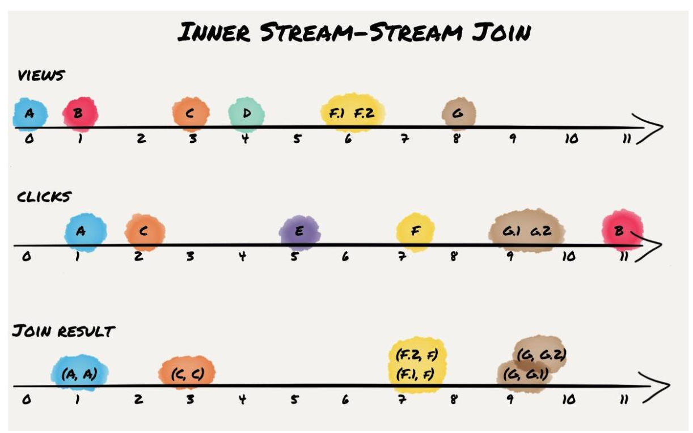

# Kafka Stream DSL

## [Stateless transformations](https://docs.confluent.io/current/streams/developer-guide/dsl-api.html#stateless-transformations)

### flatMap

```
KStream<Long, String> stream = ...;
KStream<String, Integer> transformed = stream.flatMap(
     // Here, we generate two output records for each input record.
     // We also change the key and value types.
     // Example: (345L, "Hello") -> ("HELLO", 1000), ("hello", 9000)
    (key, value) -> {
      List<KeyValue<String, Integer>> result = new LinkedList<>();
      result.add(KeyValue.pair(value.toUpperCase(), 1000));
      result.add(KeyValue.pair(value.toLowerCase(), 9000));
      return result;
    }
  );
```
Question: why here use LinkedList, could it be ArrayList<KeyValue<String, Integer>>, can it also be covert to KStream<String, Integer>?

### flatMapValues
**flatMapValues is preferable to flatMap because it will not cause data re-partitioning. However, you cannot modify the key or key type like flatMap does.**

### foreach
```
You would use foreach to cause side effects based on the input data (similar to peek) and 
then stop further processing of the input data (unlike peek, which is not a terminal operation).
```
Question: what does it means?


### groupByKey
groupByKey causes data re-partitioning if and only if the stream was marked for re-partitioning. groupByKey is preferable to groupBy because it re-partitions data only if the stream was already marked for re-partitioning. However, groupByKey does not allow you to modify the key or key type like groupBy does.
Question: why need groupByKey, what's the difference between 'to' or 'through'?  
For the following code, I don't know the difference:
```java
KStream<byte[], String> stream = ...;

// Group by the existing key, using the application's configured
// default serdes for keys and values.
KGroupedStream<byte[], String> groupedStream = stream.groupByKey();

// When the key and/or value types do not match the configured
// default serdes, we must explicitly specify serdes.
KGroupedStream<byte[], String> groupedStream = stream.groupByKey(
    Grouped.with(
      Serdes.ByteArray(), /* key */
      Serdes.String())     /* value */
  );
```

### groups

Groups the records by a new key, which may be of a different key type. When grouping a table, you may also specify a new value and value type. groupBy is a shorthand for selectKey(...).groupByKey().  
**Always causes data re-partitioning**

```java
KStream<byte[], String> stream = ...;
KTable<byte[], String> table = ...;
// Java 8+ examples, using lambda expressions
// Group the stream by a new key and key type
KGroupedStream<String, String> groupedStream = stream.groupBy(
    (key, value) -> value,
    Grouped.with(
      Serdes.String(), /* key (note: type was modified) */
      Serdes.String())  /* value */
  );

// Question
// https://docs.confluent.io/current/streams/javadocs/org/apache/kafka/streams/kstream/KStream.html#groupBy-org.apache.kafka.streams.kstream.KeyValueMapper-
// https://docs.confluent.io/current/streams/javadocs/org/apache/kafka/streams/kstream/Grouped.html

// Group the table by a new key and key type, and also modify the value and value type.
KGroupedTable<String, Integer> groupedTable = table.groupBy(
    (key, value) -> KeyValue.pair(value, value.length()),
    Grouped.with(
      Serdes.String(), /* key (note: type was modified) */
      Serdes.Integer()) /* value (note: type was modified) */
  );
```

<del>Question: Can I understand that groupby just change key's type, but map might use a different key, such as a field from value???
- `groupByKey` means group the records by the existing key
   + Grouping vs. Windowing: A related operation is windowing, which lets you control how to “sub-group” the grouped records of the same key into so-called windows for stateful operations such as windowed aggregations or windowed joins.
- `groupBy` means group the records by a new key, which may be of a different key type.  `groupBy` is a shorthand for `selectKey(...).groupByKey()`.  It will always cause data re-partitioning
- `map` takes one record and produces one record.  You can modify the record key and value, including their types.
- 在传统数据库中，`Group By`就是根据"By"指定的规则对数据进行分组,所谓的分组就是将一个“数据集”划分成若干个“小区域”，然后针对若干个“小区域”进行数据处理。就是根据By的规则把数据重新组织

## [Stateful transformations](https://docs.confluent.io/current/streams/developer-guide/dsl-api.html#stateful-transformations)

Except join, almost all other operation will return KTable.  


<br/>

### Aggregation
After records are grouped by key via groupByKey or groupBy – and thus represented as either a KGroupedStream or a KGroupedTable, they can be aggregated via an operation such as reduce.  Aggregating is a generalization of reduce.

```java
KGroupedTable<byte[], String> groupedTable = ...;

// Aggregating a KGroupedTable (note how the value type changes from String to Long)
KTable<byte[], Long> aggregatedTable = groupedTable.aggregate(
    () -> 0L, /* initializer */
    (aggKey, newValue, aggValue) -> aggValue + newValue.length(), /* adder */
    (aggKey, oldValue, aggValue) -> aggValue - oldValue.length(), /* subtractor */
    Materialized.as("aggregated-table-store") /* state store name */
	.withValueSerde(Serdes.Long()) /* serde for aggregate value */
```
<del>Question: what's the meaning of Aggregators add/sub?  
- Aggregation works like accumulator, it will iterate all events and then calculate final status based on each key.  
- When making Table from a stream, we are will generate insert/update/delete operation based on each key, that's why both Adder/Subtractor is needed.


### Reduce
Rolling aggregation. Combines the values of (non-windowed) records by the grouped key. The current record value is combined with the last reduced value, and a new reduced value is returned. **The result value type cannot be changed**, unlike `aggregate`.


### Kafka Join

#### Questions

- **Ensuring data co-partitioning**: If the inputs of a join are not co-partitioned yet, you must ensure this manually. 
Same Key must in Same partition

- Why need abstract globalKTable
   + A global KTable is replicated, in contrast to a “regular” KTable that is sharded.  a global KTable has a full copy of the data and thus allows for non-key joins and avoids data repartitioning for multiple consecutive joins; it’s very well suited for “star joins” with a fact-stream and multiple dimension KTables, similar to star joins in a data warehouse.
   + Another important difference between a KTable and a GlobalKTable is time synchronization: while processing KTable records is time synchronized based on record timestamps to all other streams, a GlobalKTable is not time synchronized. 
   + Using a GlobalKTable frees from the co-partitioning limitations.  Because a GlobalKTable holds a complete copy of all data over all partitions of its input topic, the number of KStream partitions must not match the number of GlobalKTable source topic partitions.  However, the disadvantages of a global table are an increase memory/disk usage as well as a timely decoupling of both streams. 
   + First, a GlobalKTable is completely populated before any processing is done. At startup, the GlobalKTables input topic’s end offsets are read and the topic is read up to this point populating the GlobalKTable before any processing starts. Second, if new updates are written to the GlobalKTables input topic, those updates are applied directly to the materialized table.

- Why don't use KTable to join KStream:  
   + I think its due to there might not be real story needs table join with stream.  
   + For stream-table joins, only the (left) stream input triggers a join computation while (right) table input records only update the materialized table. Because the join is not-windowed, the (left) input stream is stateless and thus, join lookups from table record to stream records are not possible.   The concept behind this semantics is the idea to enrich a data stream with auxiliary information.  For example the stream could contain a user ID and the table has the user ID as key and user information as value. Thus, the stream can be enriched with the full user profile by doing a table lookup on the user ID.


- What's the meaning of after/before in window
In formation coming from [JoinWindows Doc](https://kafka.apache.org/21/javadoc/org/apache/kafka/streams/kstream/JoinWindows.html)
```sql
     SELECT * FROM stream1, stream2
     WHERE
       stream1.key = stream2.key
       AND
       stream1.ts - before <= stream2.ts AND stream2.ts <= stream1.ts + after
```
There are three different window configuration supported:
```
   before = after = time-difference
   before = 0 and after = time-difference
   before = time-difference and after = 0
```


#### Different Kind of Joins
**One important take away is: stream join semantics are not the same as SQL (i.e., batch) semantics.**.  
**Streams cannot guarantee to process all event according to event time and thus, the result might be slightly different for multiple runs. Nevertheless, this only affects the output records that are different from SQL semantics.**


<br/>


##### An Example


<br/>

Example description


###### KStream-KStream Join


<br/>


<br/>


<br/>


Join: both side must have the key in the window
Left Join: Left has one key, while right don't have such key, will put <key, null> into topic
Outer Join: will put either side's result into topic, <key, null> if no match

Sample code

```java
KStream<String, Long> left = ...;
KStream<String, Double> right = ...;

KStream<String, String> joined = left.join(right,
    (leftValue, rightValue) -> "left=" + leftValue + ", right=" + rightValue, /* ValueJoiner */
    JoinWindows.of(Duration.ofMinutes(5)),
    Joined.with(
      Serdes.String(), /* key */
      Serdes.Long(),   /* left value */
      Serdes.Double())  /* right value */
  );

// [Perry] 
// stream-stream join is key based and window based
// ValueJoiner is the final value -> String
// The join will be triggered under the conditions listed below whenever new input is received
// Joined.with's parameter, first means the key
// second(Serdes.Long()) and third(Serdes.Double()) is the parameter passed into override function apply()
// which is used to generate the new key
```

Example in [confluent api doc](https://docs.confluent.io/current/streams/developer-guide/dsl-api.html#joining).  Because it assume all value have the same key, so when new event comes, it will use it to pair all exising value in another side.  For example, in Timestamp 9, when there is a new event "C" come to the left, it will generate new join result [C, a], [C, b] and put which into result stream.

###### KTable-KTable join

<br/>


<br/>


<br/>


Sample code

```java
KTable<String, Long> left = ...;
KTable<String, Double> right = ...;

KTable<String, String> joined = left.join(right,
    (leftValue, rightValue) -> "left=" + leftValue + ", right=" + rightValue /* ValueJoiner */
  );
// [Perry]
// KTable's update is triggered by input table's update
// If one input table is updated, the result KTable is also updated accordingly
// The result update is a new output record
```


###### KStream-KTable join


Sample code
```
KStream<String, Long> left = ...;
KTable<String, Double> right = ...;

KStream<String, String> joined = left.join(right,
    (leftValue, rightValue) -> "left=" + leftValue + ", right=" + rightValue, /* ValueJoiner */
    Joined.keySerde(Serdes.String()) /* key */
      .withValueSerde(Serdes.Long()) /* left value */
  );
// [Perry]
// Only left value need to pass into the function of apply()
// because right side is the table, and the change will not trigger new event into result stream
// Input records for the table with a null value are interpreted as tombstones, 
// which indicate the deletion of a record key from the table. Tombstones do not trigger the join
```

### Window

#### Tumbling window

```java
KStream<String, GenericRecord> pageViews = ...;

// Count page views per window, per user, with tumbling windows of size 5 minutes
KTable<Windowed<String>, Long> windowedPageViewCounts = pageViews
    .groupByKey(Grouped.with(Serdes.String(), genericAvroSerde))
    .windowedBy(TimeWindows.of(Duration.ofMinutes(5)))
    .count();
```

#### Hopping time windows

```java
// Count page views per window, per user, with hopping windows of size 5 minutes that advance every 1 minute
KTable
KTable<Windowed<String>, Long> windowedPageViewCounts = pageViews
    .groupByKey(Grouped.with(Serdes.String(), genericAvroSerde))
    .windowedBy(TimeWindows.of(Duration.ofMinutes(5).advanceBy(Duration.ofMinutes(1))))
    .count()
```

#### Sliding time windows

`JoinWindows`

#### Session Windows
Session windows are used to aggregate key-based events into so-called sessions, the process of which is referred to as sessionization.  Session windows are different from the other window types in that:
- all windows are tracked independently across keys – e.g. windows of different keys typically have different start and end times
- their window sizes sizes vary – even windows for the same key typically have different sizes
```java
// Count page views per session, per user, with session windows that have an inactivity gap of 5 minutes
KTable<Windowed<String>, Long> sessionizedPageViewCounts = pageViews
    .groupByKey(Grouped.with(Serdes.String(), genericAvroSerde))
    .windowedBy(SessionWindows.with(Duration.ofMinutes(5)))
    .count();
```


## More Info
- [Kafka stream dev guide from confluent](https://docs.confluent.io/current/streams/developer-guide/dsl-api.html)
- [Confluent Join doc](https://docs.confluent.io/current/streams/developer-guide/dsl-api.html#joining)
- [Crossing the Streams – Joins in Apache Kafka](https://www.confluent.io/blog/crossing-streams-joins-apache-kafka/) <span>&#9733;</span><span>&#9733;</span>
- [SerDes](https://kafka.apache.org/10/documentation/streams/developer-guide/datatypes.html)