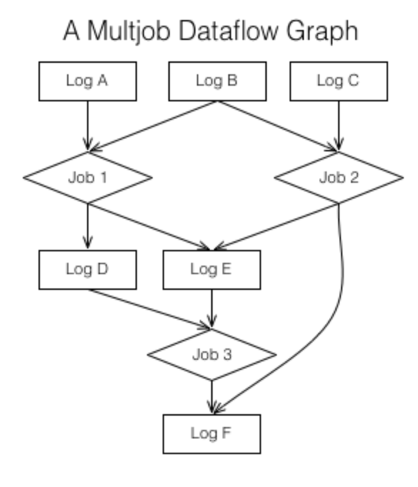

# notes about real time logs by Jay Kreps

## logs
- what is log 
- how to use logs for data integration, real time processing, and system building.

## What is log
It is an append-only, totally-ordered sequence of records ordered by time

 

## why log is important
The answer is that logs have a specific purpose: they record what happened and when
The two problems a log solves—ordering changes and distributing data—are even more important in distributed data systems.

One of the beautiful things about this approach is that the time stamps that index the log now act as the clock for the state of the replicas—you can describe each replica by a single number, the timestamp for the maximum log entry it has processed. This timestamp combined with the log uniquely captures the entire state of the replica.

 

State-Machine-> active active -> The active-active approach might log out the transformations to apply, say "+1", "*2", etc. Each replica would apply these transformations and hence go through the same set of values.

Primary-Backup -> Active-Passive ->  a single master execute the transformations and log out the result, say "1", "3", "6", etc. 

A log, after all, represents a series of decisions on the "next" value to append. 

## Data Integration
Data integration is making all the data an organization has available in all its services and systems.
ETL = Extract, transform, load

## Logs & Real-time Stream Processing
What is streaming processing  
infrastructure for continuous data processing with low latency
The real driver for the processing model is the method of data collection. Data which is collected in batch is naturally processed in batch. When data is collected continuously, it is naturally processed continuously.

Problem: during data processing, the input is keep on changing.  stream processing is just processing which includes a notion of time in the underlying data being processed and does not require a static snapshot of the data so it can produce output at a user-controlled frequency instead of waiting for the "end" of the data set to be reached. 

 

**Kafka making data available in real-time multi-subscriber data feeds**

**Log provide: sequence and buffering** 

## Streaming Table
A stream processor can keep it's state in a local "table" or "index"—a bdb, leveldb, or even something more unusual such as a Lucene or fastbit index

When the process fails, it restores its index from the changelog. The log is the transformation of the local state into a sort of incremental record at a time backup.

log compaction

 
Size <-> reproduce

## System Building

 

The things a log can do:

 

## More info
- [The Log: What every software engineer should know about real-time data's unifying abstraction](https://engineering.linkedin.com/distributed-systems/log-what-every-software-engineer-should-know-about-real-time-datas-unifying)
- Building an Event Streaming Platform [part1](https://www.confluent.io/blog/stream-data-platform-1/) [part2](https://www.confluent.io/blog/stream-data-platform-2/)
