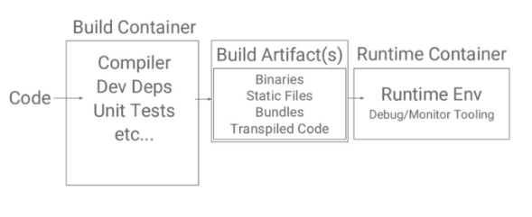
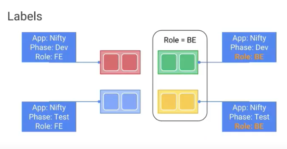
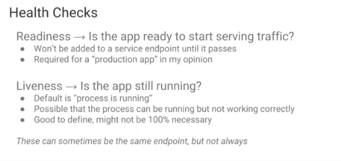
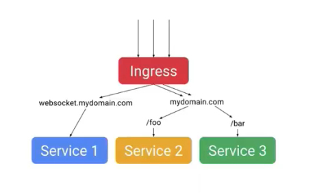

@SandeepDinesh from Google  
[Kubernetes Best Practices with Sandeep Dinesh (Google)](https://www.youtube.com/watch?v=BznjDNxp4Hs)


## Building containers
- Don’t Trust Arbitrary Base Images!
   - Random base images could have malware, bug, or some tools you don't want
   - Run static analysis, such as [CoreOS’ Clair ](https://github.com/coreos/clair) or [Banyon Collector](https://github.com/banyanops/collector)

- Keep Base Images Small
   - Smaller image means: faster builds, less storage, pulls faster, potentially less attack surface

- Use the Builder Pattern
   - Build smaller images, more useful for static languages that compile like C++ or go or typescript for node.js
   - check out code -> build code with compiler, dependencies, unit tests -> Take build artifacts, combine with static files, bundles, etc. -> go through a runtime container may contain monitoring or debugging tools
   - The final docker file should only reference base image + runtime env container




## Container Internals
- Use a Non-Root User Inside the Container  
   - For safety, If haven’t changed the user from root, someone hacks into your container, then a simple container escape could give them access to your host 
   - In k8s, you could set [Security context](https://kubernetes.io/docs/tasks/configure-pod-container/security-context/) 'runAsNonRoot: true', which will make it a policy-wide setting for the entire cluster.

- Make the File System Read-Only
  - In k8s, setting the option 'readOnlyFileSystem: true'

- One Process per Container
   - Because which suits better for the way the orchestrator works
   - Kubernetes manages containers based on whether a process is healthy or not.
    - Pod is the one used for running multiple processes that talks and have dependencies

- Don’t Restart on Failure. Crash Cleanly Instead.
   - k8s restart failed containers for you, you couls crash cleanly with an error code

- Log everything to stdout and stderr
   - By default Kubernetes listens to these pipes and sends the outputs to your logging service


## Deployments
- Use the “Record” Option for Easier Rollbacks
```
// everytime there is an update, it gets saved to the history of those deployments and it provides you with the ability to rollback a change.
kubectl apply -f deployment.yaml --record


// To get all revision
Kubectl rollout history deployments my-deployment
```
[More information](https://kubernetes.io/docs/concepts/workloads/controllers/deployment/#checking-rollout-history-of-a-deployment)

- Use Plenty of Descriptive Labels
   - Based on labels you could do a lot of powerful selections, such as "BE", "TEST", "FE+Dev"




- Use Sidecars for Proxies, Watchers, Etc.
    - In case you are running a proxy or a watcher that your business logic process depend on, deploy the credentials as a proxy into sidecar where it handles the connections


- Don’t Use Sidecars for Bootstrapping!
  - In the case of a process running in one container that is dependant on a different microservice, you can use "init containers" to wait until both processes are running before starting your container.
  - Use sidecars for events that always occur and use init containers for one time occurrences.


- Don’t Use :Latest or No Tag
   - Use 'githash'

- Readiness and Liveness Probes are Your Friend




## Services
- Don’t Use type: LoadBalancer
   - Whenever you add load balancer to your deployment file on one of the public cloud providers, it spins one up. This is great for high availability and speed, but it costs money. 
    - Use Ingress instead which lets you load balance multiple services through a single end-point. This is not only simpler, but also cheaper. This strategy, of course, will only work if you doing http or web stuff and it won’t work for UDP or TCP based applications.




- Type: Nodeport Can Be “Good Enough”

- Use Static IPs They Are Free!
   - When your service goes down you don’t have to worry about your IPs changing.
    - Google Cloud this is easy to do by creating Global IPs for your ingress
- Map External Services to Internal Ones
   -  If you need a service that is external to the cluster, what you can do is use a service with the type ExternalName 
   - call the service by its name and the Kubernetes manager passes you on to it as if it’s part of the cluster
    - Kubernetes treats the service as is if it is on the same network, but it sits actually outside of it.


## Application Architecture

- Use Helm Charts
   - Helm is basically a repository for packaged up Kubernetes configurations.
    - There are many Helm charts for popular software components that will save you a lot of time and effort.  If you want to deploy a MongoDB. There’s a preconfigured Helm chart for it with all of its dependencies that you can easily use to deploy it to your cluster.


- All Downstream Dependencies Are Unreliable

- Make Sure Your Microservices Aren’t Too Micro

- Use Namespaces to Split Up Your Cluster
   - You could create prod, dev, test in the same cluster with different namespaces.  
   - Use namespace could limit the amount of resources so the buggy process won't use all cluster resources


- Role-Based Access Control


## Reference
- [五大Kubernetes最佳实践](https://blog.csdn.net/M2l0ZgSsVc7r69eFdTj/article/details/79946780)