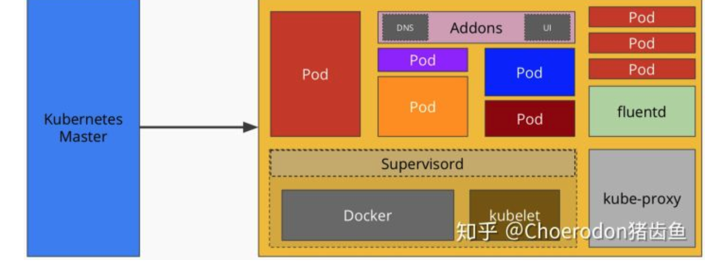

Kubernetes 是docker的管理工具  

## Kubernetes terms
- pod里面包含着容器的实例，他是k8s基本的调度单元
- Replication Controller关联着一个pod和一个pod的数量
- service 通过RC暴露出来
- K8s还会做服务发现，就是把服务名字和动态启动的地址映射在一起

 

数据的持久化
- PersistentVolume（PV）和PersistentVolumeClaim（PVC）。
- PV就是存储资源，它表示一块存储区域
- PVC就是对PV的请求，k8s自己会帮这个PVC寻找适配的PV

各个模块
- etcd：保存了整个集群的状态；
- apiserver：提供了资源操作的唯一入口，并提供认证、授权、访问控制、API 注册和发现等机制；
- controller manager：负责维护集群的状态，比如故障检测、自动扩展、滚动更新等；
- scheduler：负责资源的调度，按照预定的调度策略将 Pod 调度到相应的机器上；
- kubelet：负责维护容器的生命周期，同时也负责 Volume（CVI）和网络（CNI）的管理；
- Container runtime：负责镜像管理以及 Pod 和容器的真正运行（CRI）；
- kube-proxy：负责为 Service 提供 cluster 内部的服务发现和负载均衡

除了核心组件，还有一些推荐的 Add-ons：
- kube-dns：负责为整个集群提供 DNS 服务
- Ingress Controller：为服务提供外网入口
- Heapster：提供资源监控
- Dashboard：提供 GUI
- Federation：提供跨可用区的集群
- Fluentd-elasticsearch：提供集群日志采集、存储与查询

### K8S API
每个 API 对象都有 3 大类属性：元数据 metadata、规范 spec 和状态 status。  
元数据是用来标识 API 对象的，每个对象都至少有 3 个元数据：namespace，name 和 uid；除此以外还有各种各样的标签 labels 用来标识和匹配不同的对象，例如用户可以用标签 env 来标识区分不同的服务部署环境，分别用 env=dev、env=testing、env=production 来标识开发、测试、生产的不同服务。  

K8s 中所有的配置都是通过 API 对象的 spec 去设置的，也就是用户通过配置系统的理想状态来改变系统  
所有的操作都是声明式（Declarative）的而不是命令式（Imperative）  

### ETCD
Etcd是CoreOS基于Raft开发的分布式key-value存储，可用于服务发现、共享配置以及一致性保障（如数据库选主、分布式锁等）。
Etcd主要功能：
- 基本的key-value存储
- 监听机制
- key的过期及续约机制，用于监控和服务发现
- 原子CAS和CAD，用于分布式锁和leader选举

### kube-apiserver
kube-apiserver 是 Kubernetes 最重要的核心组件之一，主要提供以下的功能：
- 提供集群管理的 REST API 接口，包括认证授权、数据校验以及集群状态变更等
- 提供其他模块之间的数据交互和通信的枢纽（其他模块通过 API Server 查询或修改数据，只有 API Server 才直接操作 etcd）

### kube-controller-manager
Controller Manager由kube-controller-manager和cloud-controller-manager组成，是Kubernetes的大脑，它通过apiserver监控整个集群的状态，并确保集群处于预期的工作状态。

### Kubelet
每个节点上都运行一个 kubelet 服务进程，默认监听 10250 端口，接收并执行 master 发来的指令，管理 Pod 及 Pod 中的容器。每个 kubelet 进程会在 API Server 上注册节点自身信息，定期向 master 节点汇报节点的资源使用情况，并通过 cAdvisor 监控节点和容器的资源。

### Container runtime
容器运行时（Container Runtime）是 Kubernetes 最重要的组件之一，负责真正管理镜像和容器的生命周期。Kubelet 通过 Container Runtime Interface (CRI) 与容器运行时交互，以管理镜像和容器。

### kube-proxy
每台机器上都运行一个 kube-proxy 服务，它监听 API server 中 service 和 endpoint 的变化情况，并通过 iptables 等来为服务配置负载均衡（仅支持 TCP 和 UDP）。

## K8S的架构

### Master  
API Server是操作人员和k8s的接口  
Controller Manager顾名思义就是管理各种各样的controller比如先前提到的Replication Controller  
Scheduler做的事就是把用户想要启动/删除的pod分发到对应的客户端上  
内部容器与k8s cluster service的规则设置可以考虑[Ingress](https://medium.com/@Oskarr3/setting-up-ingress-on-minikube-6ae825e98f82)  

Master架构图:

### Node
Kubelet负责响应服务器端的Scheduler分出来的任务  
Proxy用来接通服务和对应的机器  

Node架构图:

### POD
[Pod](https://kubernetes.io/docs/concepts/workloads/pods/pod/) 是在 K8s 集群中运行部署应用或服务的最小单元，它是可以支持多容器的。Pod 的设计理念是支持多个容器在一个 Pod 中共享网络地址和文件系统，可以通过进程间通信和文件共享这种简单高效的方式组合完成服务。  

## K8S细节

### 数据持久化

如何把pod中的数据(比如mysql数据库)持久化  

https://kubernetes.io/docs/concepts/storage/persistent-volumes/   
问题: 多台机器同时写   
        是不是只允许一台机器挂载   

### 监控
http://qinghua.github.io/kubernetes-in-mesos-4/
cAdvisor: CPU， memory, network, storage  
InfluxDB: 一个分布式键值时序数据库,方便地查询到某段时间内的监控数据。举个栗子，查找5分钟前的数据：WHERE time > NOW() - 5m  
Grafana: 可视化 -> kubedash

### 日志
ELK: Elastic search、Logstash和Kibana三个开源软件的组合。其中logstash可以对日志进行收集、过滤和简单处理，并将其存储到elastic search上，最终供kibana展示  

[新浪是如何分析处理32亿条实时日志的？](http://dockone.io/article/505)
这个孙子还写了个文章 [大数据技术栈](https://github.com/garyelephant/blog/blob/master/notes/bigdata_stack.md)

Apache: Flume+Kafka+storm
Apache的flume扮演者类似logstash的角色来收集数据，storm可以对flume采集到的数据进行实时分析。由于数据的采集和处理速度可能不一致，因此用消息中间件kafka来作为缓冲。但是kafka不可能存储所有的日志数据，所以会用其他的存储系统来负责持久化，如同样由Apache提供的HDFS  

一篇文章带你了解Flannel  
https://juejin.im/entry/5c1b15ce5188256b9e0f0a6b  

基于Flume的美团日志收集系统  
https://tech.meituan.com/2013/12/09/meituan-flume-log-system-architecture-and-design.html  
https://tech.meituan.com/2013/12/09/meituan-flume-log-system-optimization.html  

### 性能

[kubernetes performance measurements and roadmap in 09/2015](https://kubernetes.io/blog/2015/09/kubernetes-performance-measurements-and/)  
--bind-pods-qps 每秒启动的pod数，默认为50。可以根据机器和网络性能相对应地调节。  

### 健康检查
- LivenessProbe：如果健康检查失败，就把这个容器杀掉，然后kubelet根据预先设置的重启规则来决定怎么处理：啥也不干、挂了才重启或者总是重启。
- ReadinessProbe：如果健康检查失败，这个pod的IP地址将会从endpoints里移除，所以相当于屏蔽这个pod提供的服务而不是将它杀掉。  

[K8S job](https://kubernetes.io/docs/concepts/workloads/controllers/jobs-run-to-completion/)
- 非并行：就是启动一个pod，当pod成功结束了就算是job完成了
- 固定数量并行：并行启动固定数量个pod，每个pod都成功结束了就算是job完成了
- 工作队列并行：行启动多个pod，其中一个pod成功结束了，其他pod就开始停止运行。当全部pod都停止了就算是job完成了

K8S support HPA, 根据CPU的使用率自动阔缩容  

### 部署

[K8S Rolling update]( https://kubernetes.io/docs/concepts/workloads/controllers/replicationcontroller/#rolling-updates)

- [Deployment strategy](https://github.com/ContainerSolutions/k8s-deployment-strategies)
- [Rolling out](https://kubernetes.io/docs/concepts/workloads/controllers/deployment/#rolling-update-deployment)
- [update](https://kubernetes.io/docs/tutorials/kubernetes-basics/update/update-intro/)
- [Blue/green](https://www.ianlewis.org/en/bluegreen-deployments-kubernetes)

### 网络

kubernetes对网络有三个要求：
- 所有的容器可以在不使用NAT的情况下相互通信
- 所有的主机和容器可以在不使用NAT的情况下相互通信
- 容器自己的IP和外部看它的IP是一样的  

Kubernetes 如何做到一个容器中只有一个IP地址:  
使用一个http://gcr.io/google_containers/pause 容器，别的容器在run的时候使用pause容器网络，把自己的端口通过pause暴露

此举避免了用户自己定义的端口有可能重复的问题。每个kube-proxy都会往iptables里写一条关于service虚拟IP的规则。当内部用户使用这个服务的时候，这个虚拟IP便会把流量导入到kube-proxy监听的某个端口上，由kube-proxy使用轮询或基于客户端IP的会话保持的方式，决定最终来提供服务的pod。外部用户由于没有kube-proxy，是不能访问这个服务的

### 安全
- Authentication 能否登陆
- Authorization 登陆后能干啥

## More Info
- [如果有10000台机器，你想怎么玩？](http://qinghua.github.io/kubernetes-in-mesos-1/)
- [Docker 和 Kubernetes 从听过到略懂：给程序员的旋风教程](https://juejin.im/post/5b62d0356fb9a04fb87767f5)

