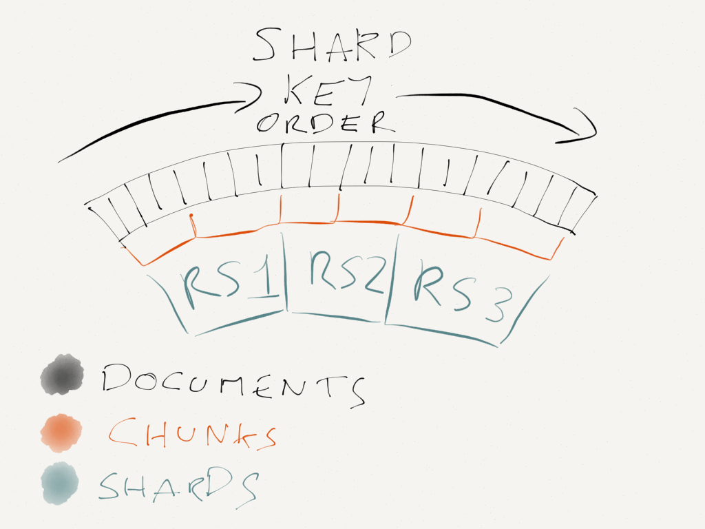

# Mongodb sharding

## What is Shards


<br/>
(refer from [How to choose a shard key for MongoDB](https://3www.bugsnag.com/blog/mongo-shard-key))

[trunk](https://docs.mongodb.com/manual/reference/glossary/#term-chunk) A contiguous range of shard key values within a particular shard. Chunk ranges are inclusive of the lower boundary and exclusive of the upper boundary. MongoDB splits chunks when they grow beyond the configured chunk size, which by default is 64 megabytes. MongoDB migrates chunks when a shard contains too many chunks of a collection relative to other shards.

[Shards](https://docs.mongodb.com/manual/core/sharded-cluster-shards/)Each shard contains a subset of the sharded data. Each shard can be deployed as a replica set.


## What makes a good shard key

- The distribution of reads and writes.  Avoid all writes go to the same machine, should never use the monotonically increasing _id or a timestamp as the shard key

- The size of your chunks.  Avoid too many documents have the same sharded key, thus avoid [jumbo chunks](https://books.google.com/books?id=pAbSHFi4WSAC&pg=PT142&lpg=PT142&dq=jumbo+chunks&source=bl&ots=Dt8gNyn5w5&sig=Tg9Ak5puKDIZyBVPoIzvJwWRFy4&hl=en&sa=X&ei=elUjU-6bJo_0oATFvYK4CQ&ved=0CHMQ6AEwBQ#v=onepage&q&f=false) 

- The number of shards each query hits.  The latency of a query is directly dependent on the latency of the slowest server it hits; so the fewer you hit, the faster queries are likely to run.


## How to define a shardkey
- use a hash of the _id of your documents for the first step
```
db.events.createIndex({_id: 'hashed'})
```
This will distribute reads and writes evenly, and it will ensure that each document has a different shard key so chunks can be fine-grained and small.
It’s not perfect, because queries for multiple documents will have to hit all shards, but it might be good enough.

- Multi-tenant compound index
grouping related documents close together in the index.  
```
At Bugsnag we group the documents by project, because of the way our app works 
most queries are run in the scope of a project. You will have to figure out a 
grouping that works for your app.  We can’t just use projectId as a shard key 
because that leads to jumbo chunks, so we also include the _id to break large 
projects into multiple chunks. These chunks are still adjacent in the index, 
and so still most likely to end up on the same shard.
```

```
db.events.createIndex({projectId: 1, _id: 1})
```
A better one could be
```
{projectId: 'hashed', _id: 1}
```

使用组合索引做shard key可以大幅度提高集群性能.“固定值+增量值” 两字段做组合索引可以有效的实现分布式集群中的分散多热点写入、读取。


```
在单个MongoDB实例上，最高效的写入是顺序写入，而MongoDB集群则要求写入能随机，以便平均分散到多个MongoDB实例。
所以最高效的写入是有多个局部热点：在多个MongoDB实例之间是分散写入，在实例内部是顺序写入。 要实现这一点，我们
采用组合索引。
例如：shardkey的第一部分是很粗糙的，可选集很少的字段，索引的第二部分是递增字段，当数据增加到一定程度时，会出现
很多第一部分相同第二部分不同的chunk，数据只会在最后一个chunk里写入数据，当第一部分不同的chunk分散在多个shard
上，就实现了多热点的写入。如果在一个shard上，不止一个chunk可以写入数据，那也就是说不止一个热点，当热点非常多的
时候，也就等同于无热点的随机写入。当一个chunk分裂之后，只能有一个成为热点，另一个不能再被写入，否则就会产生两个
热点，不再写入的chunk也就是死掉了，后续只会对它有读操作。
我在实践中除了书中讲到的组合键方式外，还加上了预分片策略，避免了早期数据增长过程中的分片和数据迁移。另外还尽可能
的制造能利用局部性原理的数据写入，例如在数据写入之前先对数据排序，有大约30%左右的update性能提升。
预分片是这样子做的：根据组合shardkey信息先分裂好chunk，把这些空chunk移动到各个shard上，避免了后续自动分裂引
起的数据迁移。

《MongoDB——The Definitive Guide 2nd Edition》
```
## Shell commands

```
// http://docs.mongodb.org/manual/reference/method/db.collection.getShardDistribution/
db.collection.getShardDistribution()—This allows you to see how a collection is distributed across your shards. It’s really useful because you can see when a collection is significantly larger on one shard than on any of the others.

// https://docs.mongodb.com/manual/reference/method/db.stats/
db.stats()—This works very similarly to the way it does in a standard replicaset, except it breaks down the output for each shard which is helpful for tracking data sizes. You can also pass in 1024*1024*1024 to get the data sizes in GB!

// https://docs.mongodb.com/manual/reference/method/sh.status/
sh.status()—This command shows you the distributions of chunks across your entire cluster. It’s useful for checking the status of the balancer.
```

## More info

- [Mongodb sharding](https://docs.mongodb.com/manual/sharding/)

