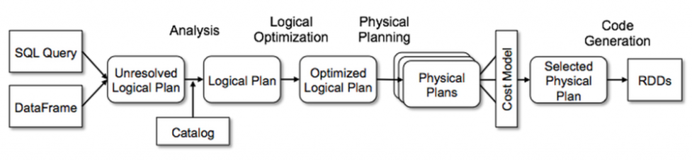

# How Spark SQL works by a simple query example


<br/>

## Case:
In the university, generate a summary of weighted mean scores for each department

```sql
SELECT dept, avg(math_score * 1.2) + avg(eng_score * 0.8) FROM students
GROUP BY dept;
```

## Query analysis
The purpose of parser(Lexer + Parser) is transforming a streaming of string to a group of tokens, then based on grammar generate a abstract syntax tree(AST).  


```js
TableScan(students)
-> Project(dept, avg(math_score * 1.2) + avg(eng_score * 0.8))
-> TableSink
```
The result will be generated as a unresolved logical plan.

More info:
- [antlr4](https://github.com/antlr/antlr4)
- [spark/sql/catalyst/parser/SqlBase.g4](https://github.com/apache/spark/blob/master/sql/catalyst/src/main/antlr4/org/apache/spark/sql/catalyst/parser/SqlBase.g4) generates sqlbaselexer and sqlbaseparser
-  [spark/sql/catalyst/parser/AstBuilder.scala](https://github.com/apache/spark/blob/master/sql/catalyst/src/main/scala/org/apache/spark/sql/catalyst/parser/AstBuilder.scala) convert parsetree to logical plan


## Analyzer
After previous step, we already have a basic structure, but Spark don't understand the keyword in tables, and have no idea of `sum, select, join, where`.  Now need schema catalog to represent those tokens.  

Unresolved logical plan missing following meta data information: table schema and function info.  Table schema contains table's column(name, type), physical address, format, how to retrieve
Function info is functions' signature and location of related class.

```js
TableScan(students=>dept:String, eng_score:double, math_score:double)
->Project(dept, math_score * 1.2:expr1, eng_score * 0.8:expr2)
->Aggregate(avg(expr1):expr3, avg(expr2):expr4, GROUP:dept)
->Project(dept, expr3+expr4:avg_result)
->TableSink(dept, avg_result->Client)
```
The result is an un-optimized logical plan

More info
- [spark/sql/catalyst/analysis/Analyzer.scala](https://github.com/apache/spark/blob/8d5ef2f766166cce3cc7a15a98ec016050ede4d8/sql/catalyst/src/main/scala/org/apache/spark/sql/catalyst/analysis/Analyzer.scala#L201)


## Optimize logical plan
### Rule based optimization

RBO的优化策略就是对语法树进行一次遍历，模式匹配能够满足特定规则的节点，再进行相应的等价转换，即将一棵树等价地转换为另一棵树。

- predicate pushdown(谓词下推)
- constant folding(常量累加)
- column pruning(列值裁剪)
- combine limits(Limits合并)


### Cost based optimization
CBO更加复杂，比如根据JOIN代价来调整JOIN顺序, 如果某个表小于特定值就广播分发


More info
- [spark/sql/catalyst/optimizer/Optimizer.scala](https://github.com/apache/spark/blob/master/sql/catalyst/src/main/scala/org/apache/spark/sql/catalyst/optimizer/Optimizer.scala)

## Code generation and query planner]

Make logic plan really executable in physical distribute environment.  For example, for `Join`, spark defines strategies like `BroadcastHashJoin`, `ShuffleHashJoin`, `SortMergeJoin` for different situation.

In the upper case, take the functor of `avg` as an example,  it will generate two nodes: Aggregates(Partial, map stage) and Aggregates(Final, reduce stage)  

```
TableScan->Project(dept, math_score * 1.2: expr1, eng_score * 0.8: expr2)
-> AggretatePartial(avg(expr1):avg1, avg(expr2):avg2, GROUP: dept)
-> ShuffleExchange(Row, KEY:dept)
-> AggregateFinal(avg1, avg2, GROUP:dept)
-> Project(dept, avg1 + avg2)
-> TableSink
```
All the operations will be converted to code running on JVM and work with RDD.

Fake implementation of `project` in spark
```scala
currentPlan.mapPartitions { iter =>
projection = loadContext()
iter.map { row => projection(row) } 
```


